# LAPORAN PRAKTIKUM - PEMROGRAMAN WEB LANJUT

---

### Identitas Mahasiswa
| Keterangan | Detail |
| :--- | :--- |
| *Nama* | Rani Miftahus Sa'adah |
| *NIM* | 244107020057 |
| *Kelas* | TI-2F |

---

## JOBSHEET 3 MIGRATION, SEEDER, DB FAÇADE, QUERY BUILDER, dan ELOQUENT ORM

### Dokumentasi Praktikum
 

<b>PRAKTIKUM 1 : Pengaturan Database</b>

 
<blockquote>

*Membuat database baru dengan nama PWL_POS*

*Menyesuaikan file .env dengan database PWL_POS*

</blockquote>

 

<b>PRAKTIKUM 2.1 : Pembuatan file migrasi tanpa relasi</b>

 
<blockquote>

*Membuat file migrasi untuk table m_level*
![Hasil Praktkum] 
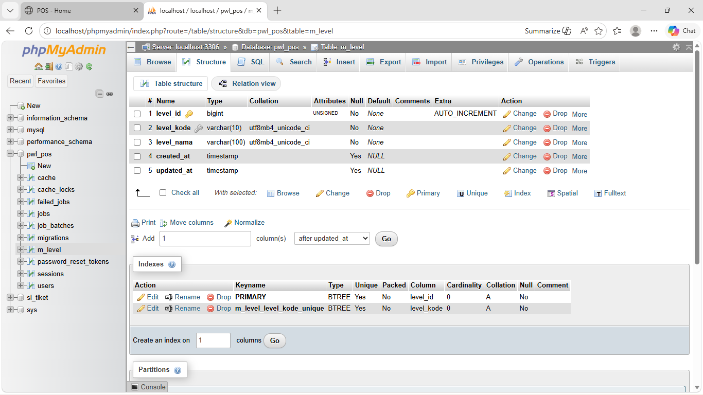

*Membuat file migrasi untuk table m_kategori*
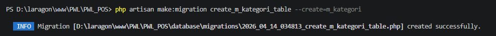
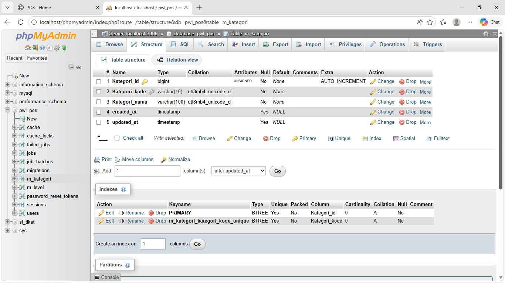

*Membuat file migrasi untuk table m_supplier*
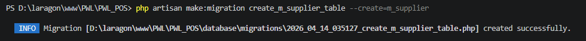
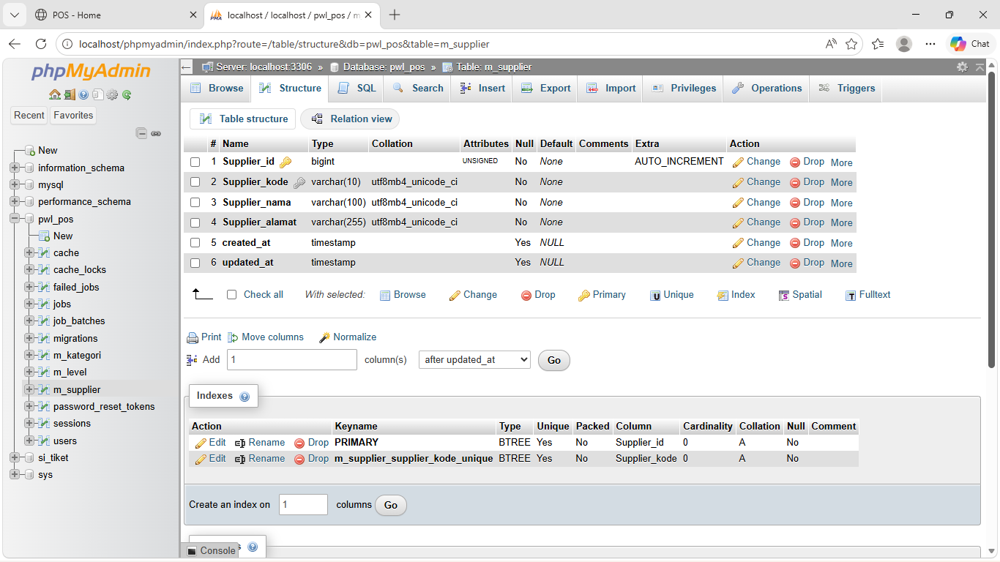

</blockquote>

 

<b>PRAKTIKUM 2.2 : Pembuatan file migrasi dengan relasi</b>

 
<blockquote>

*Membuat file migrasi untuk table m_user*
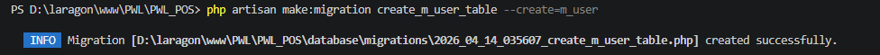
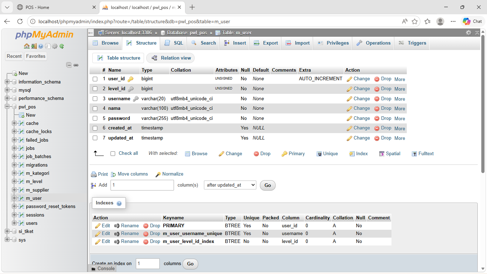

*Membuat file migrasi untuk table m_barang*
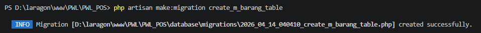
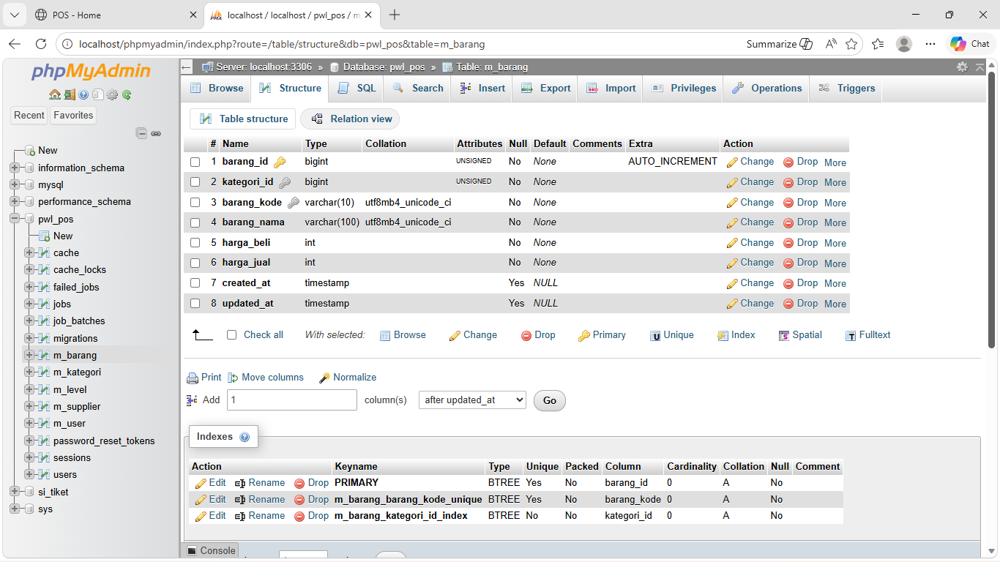

*Membuat file migrasi untuk table t_penjualan*
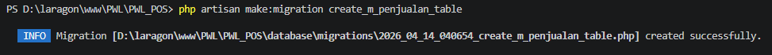
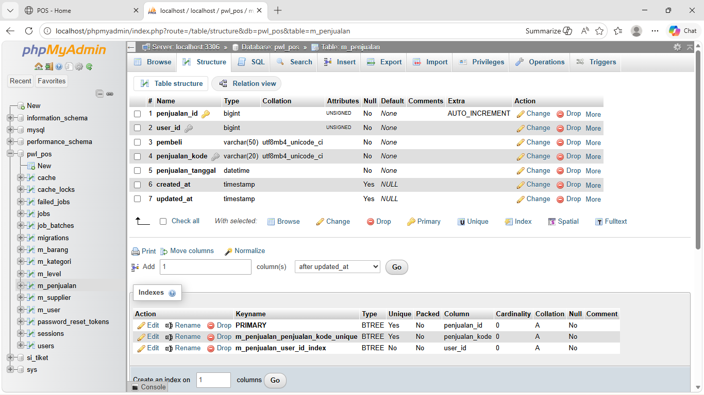

*Membuat file migrasi untuk table t_stok*
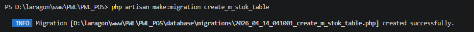
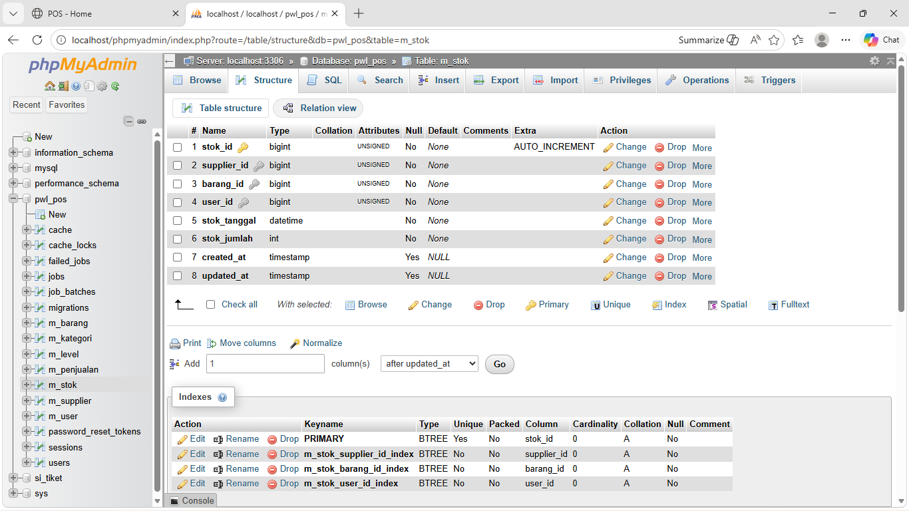

*Membuat file migrasi untuk table t_penjualan_detail*
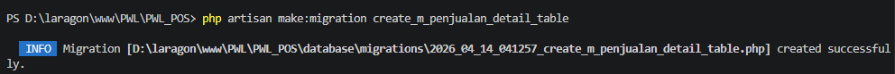
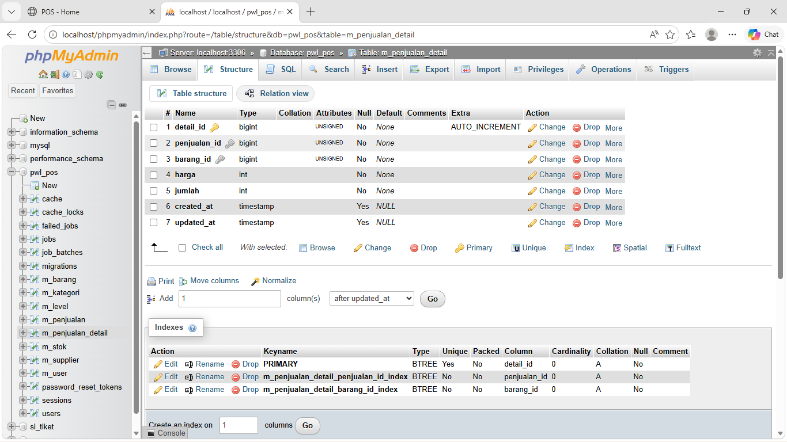

*Tampilan designer pada phpMyAdmin setelah semua file migrasi telah dibuat*
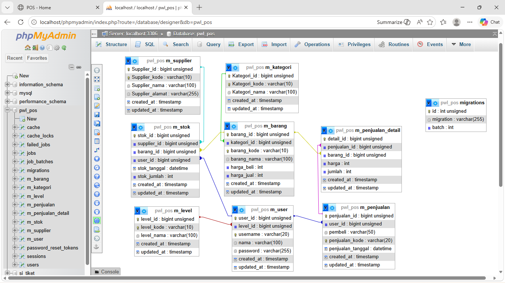

</blockquote>

 

<b>PRAKTIKUM 3 : Membuat file seeder</b>

 
<blockquote>

*Membuat file seeder untuk table m_level*
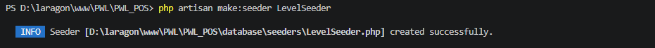
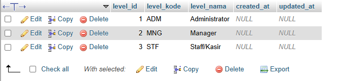

*Membuat file seeder untuk table m_user*

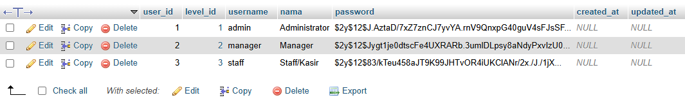

*Membuat file seeder untuk table m_kategori*

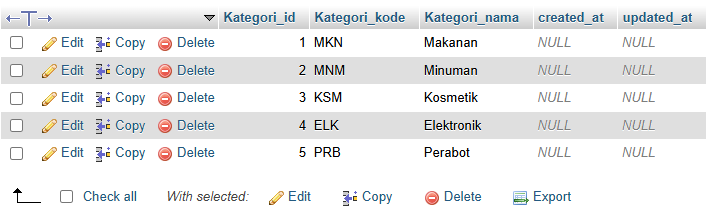

*Membuat file seeder untuk table m_supplier*
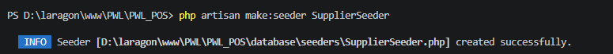
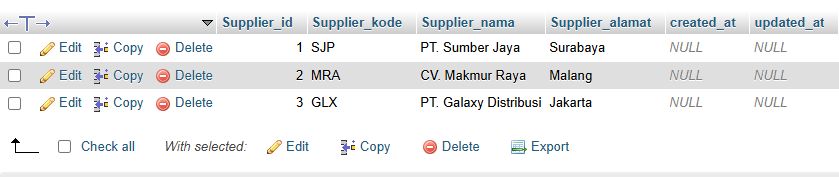

*Membuat file seeder untuk table m_barang*
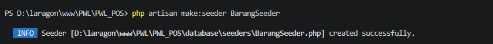
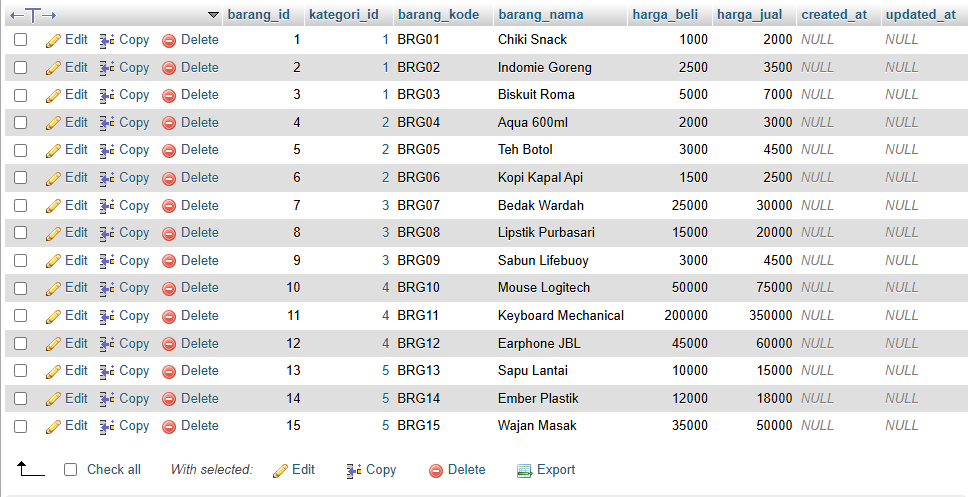

*Membuat file seeder untuk table t_stok*
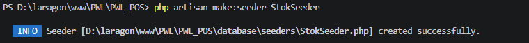
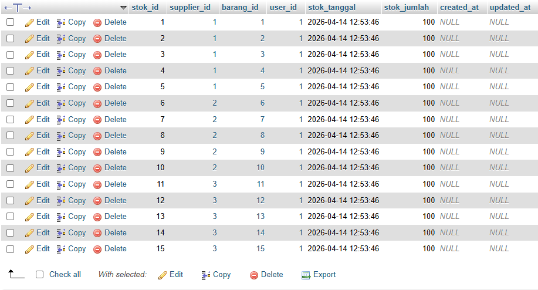

*Membuat file seeder untuk table t_penjualan*
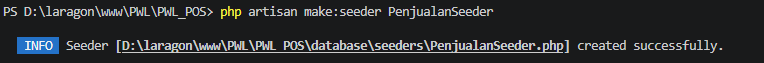
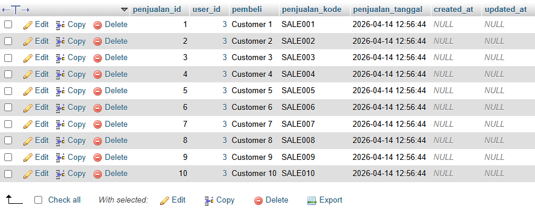

*Membuat file seeder untuk table t_penjualan_detail*
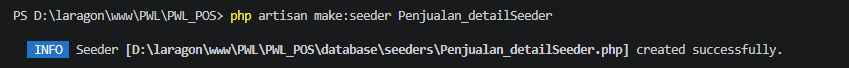
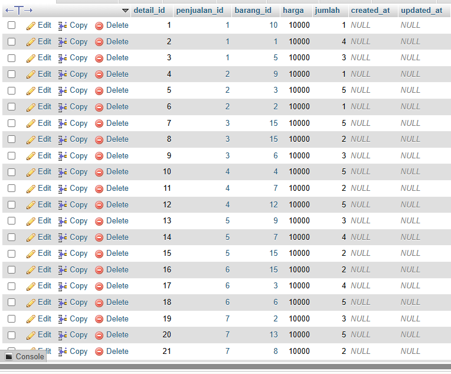

</blockquote>

 

<b>PRAKTIKUM 4 : Implementasi DB Facade</b>

 
<blockquote>

*Membuat controller untuk mengelola data pada table m_level*
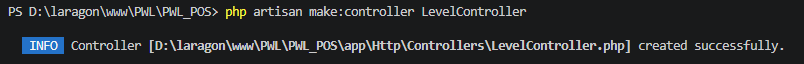

*Modifikasi file LevelController untuk menambahkan 1 data ke table m_level*
*Hasil yang terjadi pada table m_level setelah dijalankan di browser*
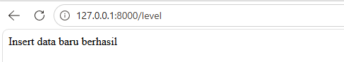
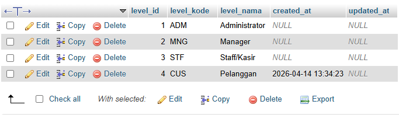

*Modifikasi file LevelController untuk meng-update data di table m_level*
*Hasil yang terjadi pada table m_level setelah dijalankan di browser*

*Modifikasi file LevelController untuk melakukan proses hapus data di table m_level*
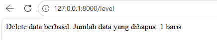

*Modifikasi file LevelController untuk menampilkan data yang ada di table m_level*
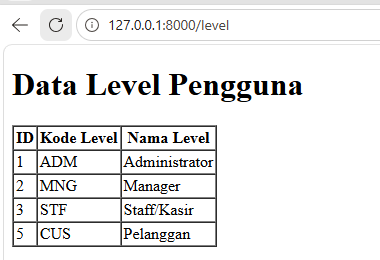

</blockquote>

 

<b>PRAKTIKUM 5 : Implementasi Query Builder</b>

 
<blockquote>

*Membuat controller untuk mengelola data pada table m_kategori*
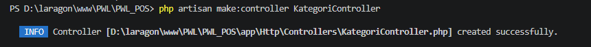

*Modifikasi routing di PWL_POS/routes/web.php*
*Modifikasi file LevelController untuk menambahkan 1 data ke table m_kategori*
*Hasil yang terjadi pada table m_kategori setelah dijalankan di browser*    

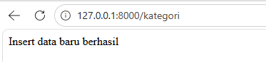

*Modifikasi file LevelController untuk meng-update data di table m_kategori*
*Hasil yang terjadi pada table m_kategori setelah dijalankan di browser*
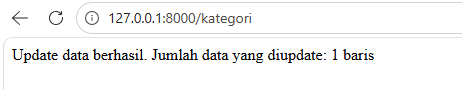

*Modifikasi file LevelController untuk melakukan proses hapus data di table m_kategori*
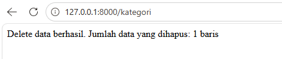

*Modifikasi file LevelController untuk menampilkan data yang ada di table m_kategori*
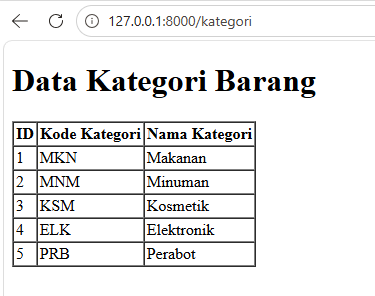

</blockquote>

 

<b>PRAKTIKUM 6 : Implementasi Eloquent ORM</b>

 
<blockquote>

*Membuat file model untuk table m_kategorim_user*
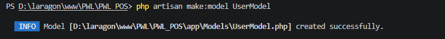

*Modifikasi file UserModel.php*

*Modifikasi route web.php untuk mencoba routing ke controller UserController*

*Membuat file controller UserContoller dan modifikasi*    

*Membuat view user.blade.php*

*Hasil yang terjadi setelah dijalankan di browser*

*Modifikasi lagi file UserController*

*Modifikasi lagi file UserController*

</blockquote>

 

<b>PENUTUP : 
Jawablah pertanyaan berikut sesuai pemahaman materi di atas</b>

 
<blockquote>

*1. Pada Praktikum 1 - Tahap 5, apakah fungsi dari APP_KEY pada file setting .env Laravel?*
Jawab : 
APP_KEY digunakan sebagai kunci enkripsi utama untuk mengamankan data sesi pengguna, cookie, dan data terenkripsi lainnya di dalam aplikasi Laravel. Tanpa kunci ini, data sensitif yang disimpan aplikasi bisa lebih mudah diretas.

*2. Pada Praktikum 1, bagaimana kita men-generate nilai untuk APP_KEY?*
Jawab : 
Kita dapat men-generate nilai tersebut dengan menjalankan perintah berikut di terminal/CMD: php artisan key:generate

*3. Pada Praktikum 2.1 - Tahap 1, secara default Laravel memiliki berapa file migrasi? dan untuk apa saja file migrasi tersebut?*
Jawab : 
Secara default (pada Laravel versi terbaru), terdapat 4 file migrasi:
- create_users_table: Untuk menyimpan data pengguna.
- create_password_reset_tokens_table: Untuk menyimpan token saat pengguna lupa password.
- create_failed_jobs_table: Untuk mencatat antrean (queue) yang gagal diproses.
- create_personal_access_tokens_table: Untuk autentikasi API (Sanctum).

*4. Secara default, file migrasi terdapat kode $table->timestamps();, apa tujuan/output dari fungsi tersebut?*
Jawab : 
Fungsi ini akan menghasilkan dua kolom otomatis di tabel database, yaitu created_at (mencatat waktu saat data dibuat) dan updated_at (mencatat waktu saat data terakhir kali diubah).

*5. Pada File Migrasi, terdapat fungsi $table->id(); Tipe data apa yang dihasilkan dari fungsi tersebut?*
Jawab : 
Fungsi ini menghasilkan tipe data Big Integer dengan sifat Unsigned (hanya angka positif) dan Auto-Increment yang berfungsi sebagai Primary Key.

*6. Apa bedanya hasil migrasi pada table m_level, antara menggunakan $table->id(); dengan menggunakan $table->id('level_id'); ?*
Jawab : 
- $table->id(); akan membuat kolom Primary Key dengan nama default id.
- $table->id('level_id'); akan membuat kolom Primary Key dengan nama kustom yaitu level_id.

*7. Pada migration, Fungsi ->unique() digunakan untuk apa?*
Jawab : 
Digunakan untuk memastikan bahwa data dalam kolom tersebut tidak boleh ada yang sama (duplikat) di dalam satu tabel. Contohnya digunakan pada kolom username atau email.

*8. Pada Praktikum 2.2 - Tahap 2, kenapa kolom level_id pada tabel m_user menggunakan $tabel->unsignedBigInteger('level_id'), sedangkan kolom level_id pada tabel m_level menggunakan $tabel->id('level_id') ?* 
Jawab : 
Pada tabel m_level, kita menggunakan $table->id('level_id') karena ia adalah Primary Key (pemberi identitas). Sedangkan pada tabel m_user, kita menggunakan $table->unsignedBigInteger('level_id') karena ia adalah Foreign Key (penerima referensi). Tipe datanya harus sama (sama-sama Unsigned Big Integer), tetapi hanya Primary Key yang memiliki fungsi Auto-Increment.

*9. Pada Praktikum 3 - Tahap 6, apa tujuan dari Class Hash? dan apa maksud dari kode program Hash::make('1234');?*
Jawab : 
Class Hash bertujuan untuk memberikan keamanan pada data sensitif (seperti password) dengan algoritma enkripsi satu arah (hashing). Kode Hash::make('1234'); berarti mengubah teks asli "1234" menjadi kode acak yang tidak bisa dibaca kembali, sehingga jika database bocor, password asli user tetap aman.

*10. Pada Praktikum 4 - Tahap 3/5/7, pada query builder terdapat tanda tanya (?), apa kegunaan dari tanda tanya (?) tersebut?*
Jawab : 
Tanda tanya tersebut adalah Parameter Binding atau Placeholder. Gunanya untuk mencegah SQL Injection. Laravel akan otomatis membersihkan inputan user sebelum dimasukkan ke dalam query SQL.

*11. Pada Praktikum 6 - Tahap 3, apa tujuan penulisan kode protected $table = ‘m_user’; dan protected $primaryKey = ‘user_id’; ?*
Jawab : 
- protected $table = 'm_user';: Memberitahu Laravel bahwa model ini terhubung ke tabel bernama m_user (karena secara default Laravel mencari tabel bentuk jamak/plural).
- protected $primaryKey = 'user_id';: Memberitahu Laravel bahwa Primary Key tabel tersebut adalah user_id, bukan kolom id.

*12. Menurut kalian, lebih mudah menggunakan mana dalam melakukan operasi CRUD ke database (DB Façade / Query Builder / Eloquent ORM) ? jelaskan*
Jawab :
Menurut saya, Eloquent ORM adalah yang paling mudah. Karena penulisan kodenya jauh lebih singkat, sangat mirip dengan bahasa manusia (objek), dan kita tidak perlu menulis query SQL manual. Selain itu, Eloquent secara otomatis menangani relasi antar tabel dengan sangat rapi. Namun, untuk query yang sangat kompleks, Query Builder terkadang lebih efisien.

</blockquote>

 

---

## JOBSHEET 4 MODEL dan ELOQUENT ORM

### Dokumentasi Praktikum
 

<b>PRAKTIKUM 1 : $fillable</b>

 
<blockquote>

Langkah 3
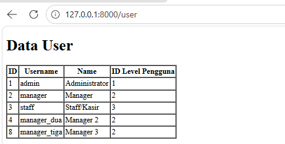
Penjelasan:
Data berhasil tersimpan ke database termasuk kolom password, karena semua kolom ('level_id', 'username', 'nama', 'password') ada di $fillable. Halaman browser menampilkan seluruh data user.

Langkah 6
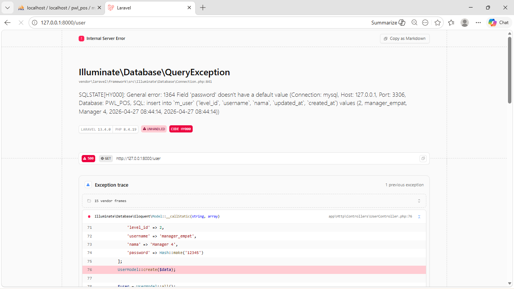
Penjelasan:
Hal ini terjadi karena pada controller masih ada 'password' => Hash::make('12345') dalam $data. Karena password tidak ada di $fillable, Laravel mengabaikan kolom password saat create(). Akibatnya MySQL mencoba insert tanpa nilai password, padahal kolom password di database NOT NULL tanpa default value → error!

</blockquote>

 

<b>PRAKTIKUM 2.1 : Retrieving Single Models</b>

 
<blockquote>

Langkah 3
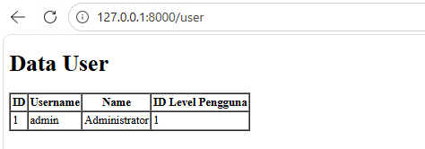
Penjelasan:
Dengan menggunakan find(1) kita dapat mencari data user dengan id 1, isi dari
function find sendiri digunakan untuk merujuk pada id yang ingin dicari.

Langkah 5
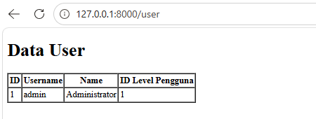
Penjelasan:
Kode di atas digunakan untuk mencari menggunakan kondisi, yang dimana
ketika level_id sama dengan 1. Ketika data ditemukan maka akan muncul pada
browser atau diambil dan dikirim ke view.

Langkah 7
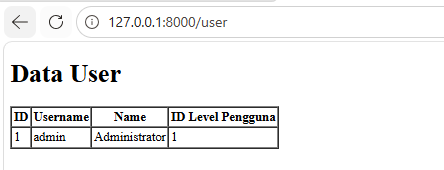
Penjelasan:
Dengan menggunakan syntax di atas, kita dapat lebih mempresingkat dengan
memanggil function firstWhere(kolom, data) untuk mencari sebuah data pada
database dan akan memunculkan data yang paling cocok dengan yang dicari

Langkah 9
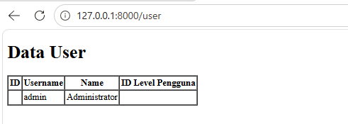
Penjelasan:
Pada findOr kita dapat menetapkan kolom apa saja yang ingin kita panggil ketika
id yang diinginkan ditemukan, lalu kita dapat menambahkan function yang berisi
abort 404 ketika data tidak ditemukan.

Langkah 11
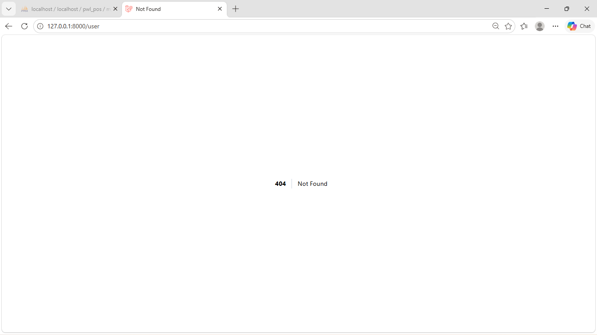
Ketika data tidak ditemukan, maka function akan mereturn abort 404 kepada
view Sehingga tampil halaman not found di atas.
 
</blockquote>

 

<b>PRAKTIKUM 2.2 : Not Found Exceptions</b>

 
<blockquote>

Langkah 2
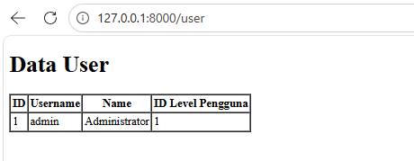
Penjelasan:
FindOrFail(1) artinya kita mencari id 1 pada table user, lalu data akan
ditampilkan dan dikirim ke view.

Langkah 4
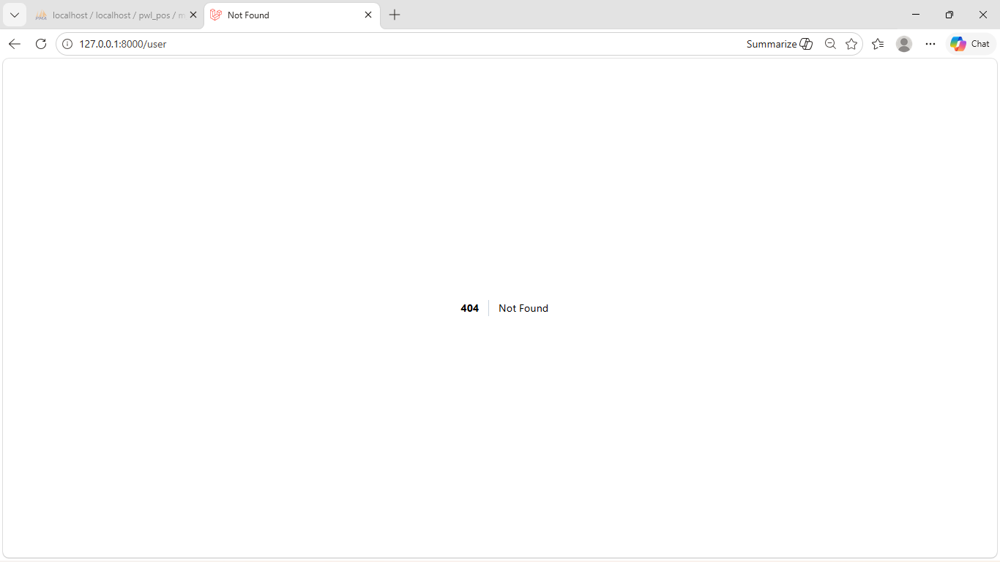
Penjelasan:
Kode di atas ingin mencari usename manager9, akan tetapi tidak ditemukan
hingga pada browser muncul 404 not found. Hal ini dikarenakan kita memanggil
function firstOrFail, yang dimana nantinya ketika data tidak ditemukan maka akan memunculkan abort 404 alih alih error, sedangkan jika berhasil, maka akan
menampilkan data pertama yang paling cocok dengan yang dicari.

</blockquote>

 

<b>PRAKTIKUM 2.3 : Retreiving Aggregrates</b>

 
<blockquote>

Langkah 2
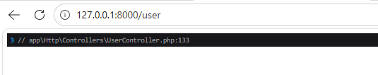
Kode di atas digunakan untuk menghitung berapa banyak user yang memiliki
level_id 2, lalu $user disalin dalam bentuk json menggunakan dd().

Langkah 4
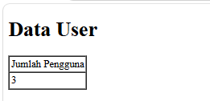

</blockquote>

 

<b>PRAKTIKUM 2.4 : Retreiving or Creating Models</b>

 
<blockquote>

Langkah 3
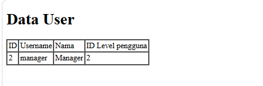
Penjelasan:
Dengan menggunakan firstOrCreate kita dapat mencari data atau menambahkan
data jika belum ada, contoh di atas mencari username manager dengan nama
Manager, lalu jika ditemukan akan ditampilkan hasilnya.

Langkah 5
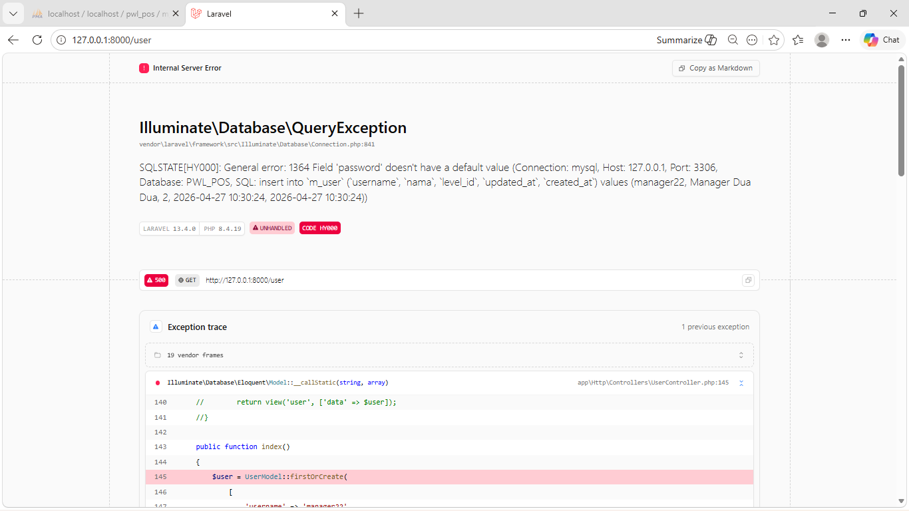
Penjelasan:
Error yang sama seperti sebelumnya — password doesn't have a default value.
Ini terjadi karena firstOrCreate mencoba insert data manager22 tapi password tidak ada di $fillable.
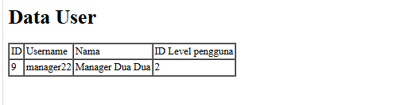
Penjelasan:
Kode di atas merupakan contoh implementasi ketika ingin menambahkan user
yang belum ada pada database menggunakan firstOrCreate. Setelah dibuat, user
akan ditampilkan pada view.

Langkah 7
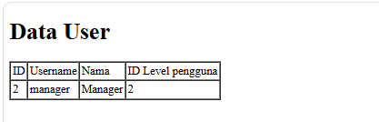
Penjelasan:
Sama halnya dengan firstOrNew, kita dapat mencari data sesuai yang diinginkan
sebagai contoh mencari username manager dengan nama Manager.

Langkah 9
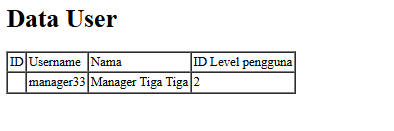
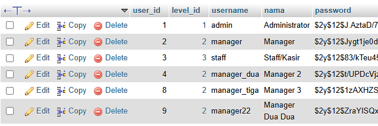
Penjelasan:
Kita dapat menambahkan data untuk ditampilkan pada browser, tetapi jika
menggunakan firstOrNew data yang ditambahkan tidak akan otomatis masuk
pada database.

Langkah 11
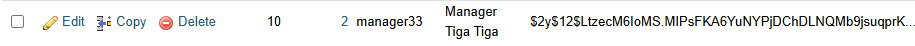
Penjelasan:
Dengan memanggil function save, data user yang baru akan disave kedalam
database.

</blockquote>

 

<b>PRAKTIKUM 2.5 : Attribute Changes</b>

 
<blockquote>

Langkah 2
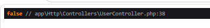
Penjelasan:
false:
Setelah save() dipanggil, Eloquent menganggap semua perubahan sudah tersimpan ke database, sehingga isDirty() mengembalikan false dan isClean() mengembalikan true. Output false pada browser adalah hasil yang benar dan sesuai, bukan error.

Langkah 4
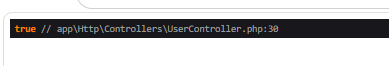
Penjelasan:
Function wasChanged() digunakan setelah $user->save() untuk mengecek apakah
ada atribut yang baru saja berubah saat proses penyimpanan tadi.
</blockquote>

 

<b>PRAKTIKUM 2.6 : Create, Read, Update, Delete (CRUD)</b>

 
<blockquote>

Langkah 3
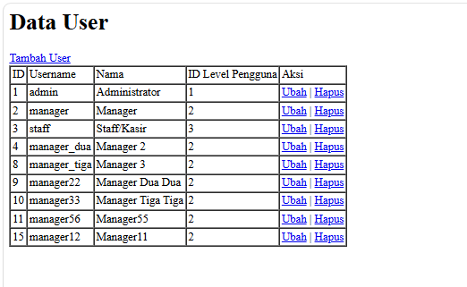
Penjelasan:
Kode yang digunakan untuk menampilkan semua data user yang ada di database,
lalu menambahkan 2 link di tiap baris untuk melakukan aksi ubah dan hapus.

Langkah 7
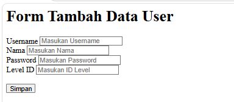
Penjelasan:
alur Route → Controller → View berjalan dengan benar. Halaman form berhasil ditampilkan saat link "+ Tambah User" diklik, dan form siap menerima input data user baru yang nantinya akan disimpan ke database pada langkah berikutnya.

Langkah 10
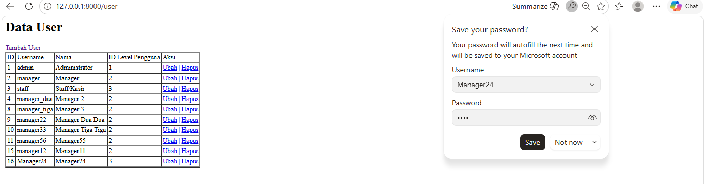

Penjelasan:
Dengan menambahkan route post untuk menangkap data yang diberikan pada
form, kita dapat menambahkan data menggunakan form seperti di atas,
menambahkan username Manager24 dengan nama Manager24, dan tersimpan di database.

Langkah 14
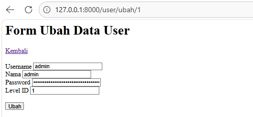
Penjelasan:
Pada langkah ini, proses simpan perubahan data di browser masih akan error, karena rute (route) untuk ubah_simpan belum dibuat.

Langkah 17
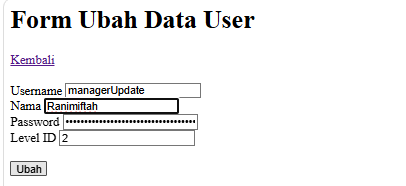
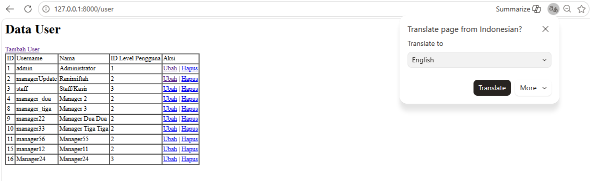
Penjelasan:
Dengan menggunakan request, kita dapat menimpa attribute yang ingin diubah,
seperti di atas, mengubah nama yang awalnya Manager2 menjadi Ranimiftah, dengan mencari id
yang ingin diubah terlebih dahulu menggunakan find($id) lalu menimpa semua
data yang ada pada database dengan yang ada di form.

Langkah 20
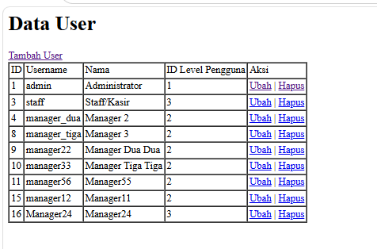
Penjelasan:
Ketika mengklik link atau tombol hapus, route akan memanggil user controller
dengan function hapus, lalu mencari id pada baris yang ingin dihapus, lalu
menjalankan function atau aksi delete() setelah berhasil maka akan di redirect ke
page ‘/user’.
Tabel Ranimiftah berhasil di hapus
</blockquote>

 

<b>PRAKTIKUM 2.7 : Relationships</b>

 
<blockquote>

Langkah 3
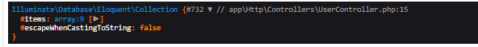
Penjelasan:
Hasil dd($user) menampilkan objek Illuminate\Database\Eloquent\Collection yang berisi 9 data user. Penggunaan with('level') menunjukkan bahwa Eloquent berhasil melakukan eager loading — artinya data relasi dari tabel m_level ikut diambil sekaligus dalam satu query tanpa perlu query tambahan untuk setiap user. Ini membuktikan bahwa relasi belongsTo antara UserModel dan LevelModel telah berhasil didefinisikan dengan benar.

Langkah 6
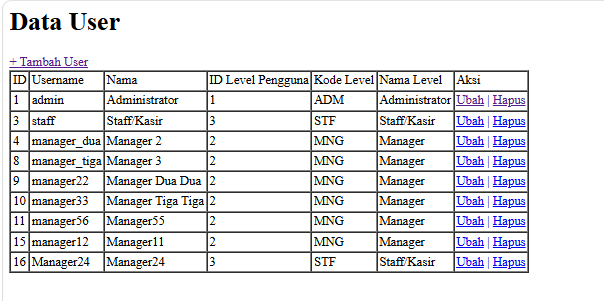
Penjelasan:
 relasi belongsTo antara UserModel dan LevelModel bekerja dengan benar. Dengan menggunakan UserModel::with('level')->get(), Eloquent mampu menggabungkan data dari dua tabel (m_user dan m_level) secara efisien menggunakan teknik eager loading. Hasilnya, kolom Kode Level (ADM, MNG, STF) dan Nama Level (Administrator, Manager, Staff/Kasir) berhasil ditampilkan di halaman Data User tanpa perlu melakukan query manual ke tabel m_level.
</blockquote>

 
--- 

Tahun Akademik 2025/2026

