# LAPORAN PRAKTIKUM - WEEK 05 PEMROGRAMAN WEB LANJUT

---

### Identitas Mahasiswa
| Keterangan | Detail |
| :--- | :--- |
| **Nama** | Rani Miftahus Sa'adah |
| **NIM** | 244107020057 |
| **Kelas** | TI-2F |

---
## JOBSHEET WEEK 05 
### JOBSHEET 1 Instalasi dan Setup Filament PHP v4 pada Laravel 11

#### Dokumentasi Praktikum
 

<b>Hasil Praktikum</b>

 
<blockquote>

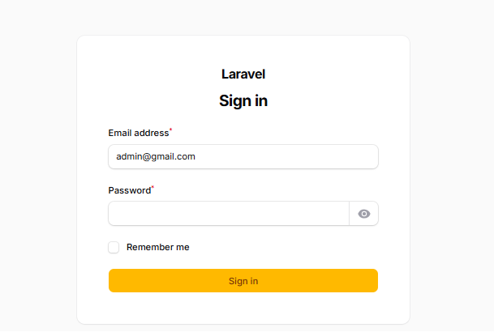
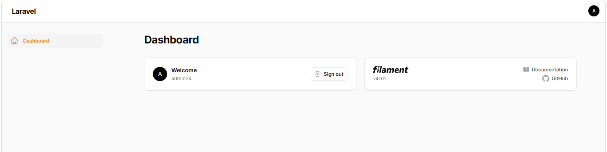

</blockquote>

 

<b>Analisis & Diskusi</b>

 
<blockquote>

**1. Apa kelebihan Filament dibanding membuat admin panel manual?**
 
Jawab : 
Filament memiliki kelebihan dibandingkan membuat admin panel secara manual karena mampu mempercepat proses pengembangan dengan menyediakan fitur otomatis seperti CRUD, form, tabel, dan autentikasi tanpa harus membuat semuanya dari awal. Dengan hanya menggunakan perintah artisan, developer sudah bisa mendapatkan struktur admin panel yang lengkap dan siap digunakan. Selain itu, Filament juga memberikan tampilan yang modern, konsisten, serta mudah dikustomisasi sehingga lebih efisien dari segi waktu dan tenaga.

**2. Mengapa Filament menggunakan Livewire?**
 
Jawab : 
Filament menggunakan Livewire karena teknologi ini memungkinkan pembuatan antarmuka yang interaktif tanpa perlu banyak menggunakan JavaScript. Livewire bekerja dengan menghubungkan frontend dan backend secara langsung dalam Laravel, sehingga setiap perubahan data dapat diperbarui secara real-time. Hal ini membuat proses pengembangan menjadi lebih sederhana karena developer cukup fokus pada logika backend tanpa perlu membangun API atau menggunakan framework frontend tambahan.

**3. Apa perbedaan SQLite dan MySQL dalam development?**
 
Jawab : 
Perbedaan SQLite dan MySQL dalam development terletak pada cara penggunaan dan skalanya. SQLite adalah database ringan yang tidak memerlukan server dan biasanya digunakan untuk tahap pengembangan awal atau testing karena mudah dikonfigurasi. Sedangkan MySQL merupakan database berbasis server yang lebih kompleks namun lebih stabil dan mampu menangani data dalam jumlah besar, sehingga lebih cocok digunakan pada tahap production atau aplikasi skala besar.

**4. Apa fungsi Panel Builder?**
 
Jawab : 
Panel Builder pada Filament berfungsi sebagai alat untuk membangun dan mengelola admin panel secara otomatis. Dengan fitur ini, developer dapat mengatur halaman, navigasi, autentikasi, dan tampilan dashboard tanpa harus membuatnya secara manual. Panel Builder membantu mempercepat proses pembuatan admin panel serta memastikan struktur aplikasi lebih rapi, terorganisir, dan mudah dikembangkan.

</blockquote>

 

---

### JOBSHEET 2 Membuat CRUD Resource dengan Filament v4
#### Dokumentasi Praktikum
 

<b>Hasil Praktikum</b>

 
<blockquote>

**Menjalankan Aplikasi**
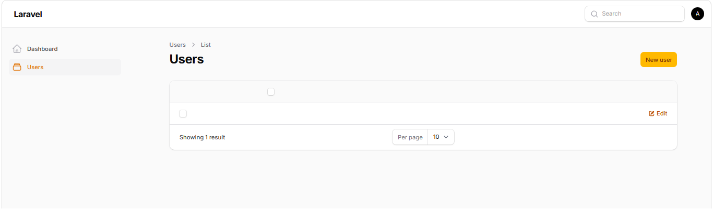
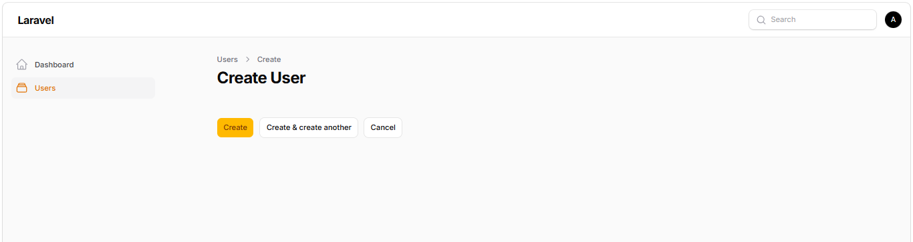

**Membuat Form Input (Create & Edit)**
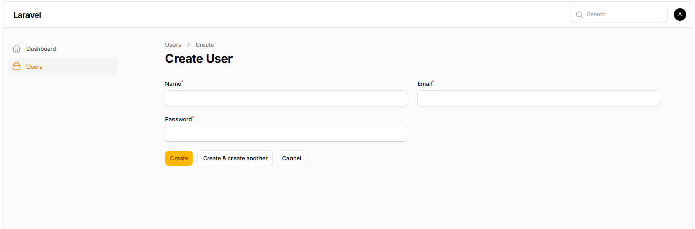
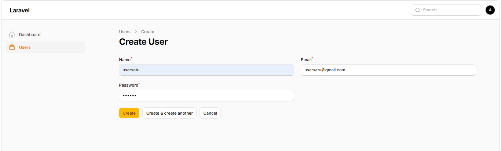
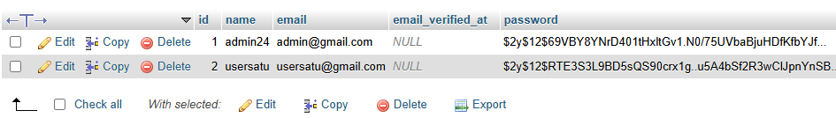
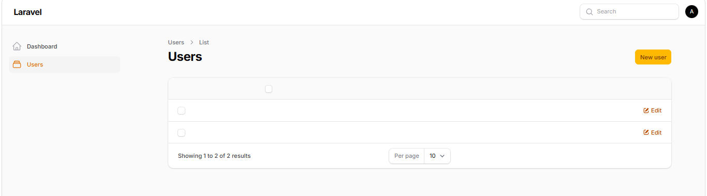

**Menampilkan Data pada Tabel**
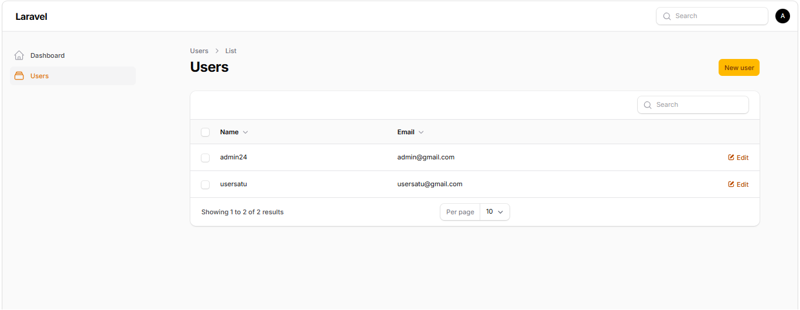

**Mengganti Icon Menu Resource**
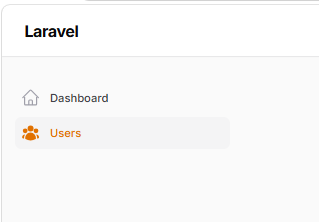
</blockquote>

 

<b>Analisis & Diskusi</b>

 
<blockquote>

**1. Mengapa Filament dapat membuat CRUD tanpa banyak coding?**
 
Jawab : 
Filament mampu menghasilkan CRUD secara otomatis karena mengadopsi konsep Resource yang terintegrasi dengan Laravel. Saat pengembang menjalankan perintah php artisan make:filament-resource, Filament akan membaca struktur model dan menghasilkan empat komponen utama: halaman daftar (List), halaman tambah (Create), halaman edit (Edit), serta file-form dan file-tabel yang sudah siap pakai. Di balik layar, Filament memanfaatkan Livewire untuk interaktivitas real-time tanpa perlu menulis JavaScript, serta komponen Form Builder dan Table Builder yang dapat langsung digunakan dengan konfigurasi minimal. Dengan hanya mendefinisikan kolom-kolom yang diperlukan (misalnya name, email, password), sistem secara otomatis membangun tampilan, validasi dasar, serta mekanisme penyimpanan dan pembaruan data. Hal ini mempercepat pengembangan admin panel secara drastis dibandingkan membuat CRUD manual yang memerlukan routing, controller, view, dan logika penyimpanan sendiri.

**2. Apa perbedaan Form Schema dan Table Schema?**
 
Jawab : 
Form Schema digunakan untuk menyusun formulir input data pada halaman Create dan Edit. Di dalamnya terdapat komponen-komponen seperti TextInput, Select, FileUpload, yang bertugas mengumpulkan data dari pengguna, dilengkapi dengan aturan validasi (misalnya required, email, unique). Sementara itu, Table Schema digunakan untuk menampilkan data dalam bentuk daftar pada halaman List. Komponen-komponennya seperti TextColumn, ImageColumn, BadgeColumn berfungsi menyajikan data dari database ke dalam tabel interaktif yang mendukung pencarian, pengurutan, filter, dan pemilihan data massal. Intinya, Form Schema berfokus pada cara data dimasukkan dan divalidasi, sedangkan Table Schema berfokus pada cara data ditampilkan dan dieksplorasi. Keduanya bekerja secara independen namun saling melengkapi dalam siklus CRUD.

**3. Bagaimana jika kita ingin menambahkan validasi email unik?**
 
Jawab : 

Untuk memastikan email bersifat unik (tidak ada duplikat), kita cukup menambahkan method unique() pada komponen TextInput di Form Schema. Contohnya: TextInput::make('email')->email()->required()->unique('users', 'email'). Validasi ini akan memeriksa tabel users pada kolom email apakah nilai yang dimasukkan sudah ada. Filament secara otomatis menampilkan pesan error jika validasi gagal, tanpa perlu menulis kode validasi manual di controller. Untuk skenario update di mana email milik record yang sedang diedit seharusnya dianggap valid meskipun sama, kita bisa menggunakan unique('users', 'email')->ignore($record). Validasi unik email ini penting untuk menjaga integritas data dan mencegah akun duplikat.

**4. Mengapa password tidak perlu kita hash manual?**
 
Jawab : 
Filament menangani hashing password secara otomatis, sehingga pengembang tidak perlu memanggil fungsi bcrypt() atau Hash::make() secara manual. Ketika kita menggunakan komponen TextInput::make('password')->password() pada Form Schema, Filament akan mengenali bahwa field tersebut adalah password dan akan melakukan hashing sebelum menyimpannya ke database. Mekanisme ini biasanya dikelola melalui mutator pada model User (misalnya setPasswordAttribute()) atau karena Filament memanfaatkan fitur casts Laravel. Dengan demikian, kode menjadi lebih bersih, aman, dan konsisten. Selain itu, hashing otomatis juga mengurangi kemungkinan kesalahan manusia seperti lupa mengenkripsi password atau salah menerapkan algoritma hash.

</blockquote>

 

---

### JOBSHEET 3 Membuat Migration, Model, Relasi & Resource Category

#### Dokumentasi Praktikum
 

<b>Hasil Praktikum</b>

 
<blockquote>

**Mendesain Tabel Categories**
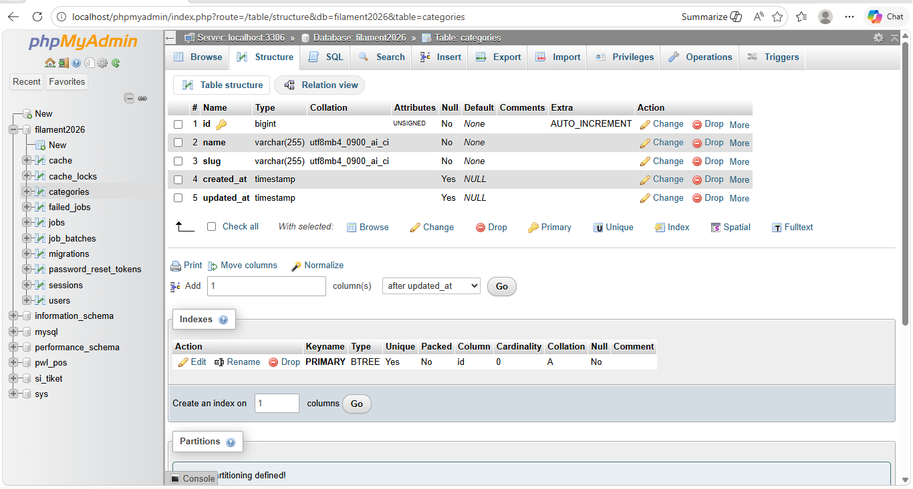

**Membuat Resource Category di Filament**
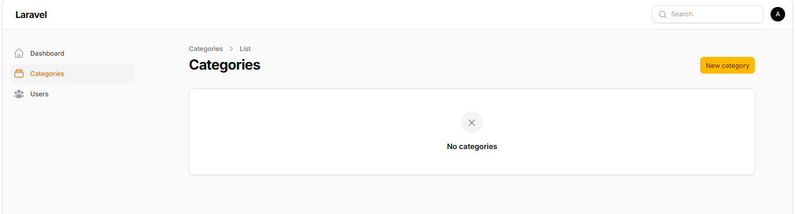
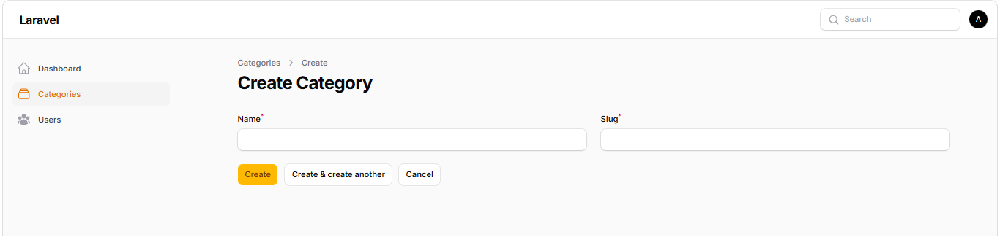
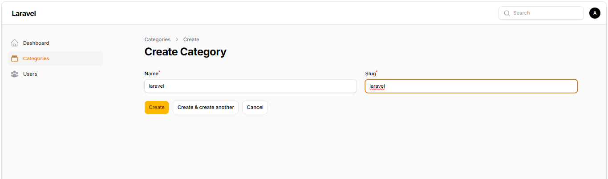
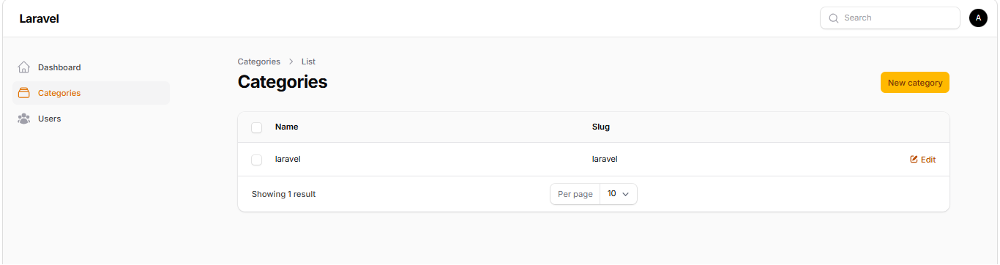

</blockquote>

 

<b>Analisis & Diskusi</b>

 
<blockquote>

**1. Mengapa kita perlu $fillable?**
 
Jawab : 
$fillable digunakan untuk menentukan kolom mana saja yang diizinkan untuk diisi secara massal (mass assignment). Hal ini merupakan fitur keamanan Laravel untuk mencegah pengguna mengirimkan data berbahaya (seperti mengubah status is_admin secara ilegal) melalui form input.

**2. Apa fungsi $casts pada Laravel?**
 
Jawab : 
Property $casts berfungsi untuk mengkonversi nilai atribut model secara otomatis ke tipe data PHP yang sesuai ketika data diambil dari maupun disimpan ke database. Tanpa casting, semua data yang keluar dari database akan berbentuk string mentah, sehingga harus dikonversi secara manual di setiap bagian kode. Dengan $casts, Laravel menangani konversi tersebut secara otomatis. Sebagai contoh, field tags yang bertipe JSON di database akan otomatis dikonversi menjadi array PHP saat diakses, field published yang bertipe boolean akan otomatis bernilai true atau false, dan field published_at akan otomatis menjadi instance Carbon sehingga dapat langsung dimanipulasi menggunakan method-method tanggal seperti format() atau diffForHumans().

**3. Apa perbedaan integer biasa dengan foreign key?**
 
Jawab : 
Integer biasa hanyalah tipe data kolom yang menyimpan angka tanpa memiliki aturan atau ketergantungan terhadap tabel lain. Sedangkan foreign key adalah integer yang secara eksplisit merujuk pada primary key di tabel lain dan dilengkapi dengan constraint di level database. Perbedaan utamanya terletak pada integritas data: foreign key menjamin bahwa nilai yang disimpan di kolom tersebut pasti ada di tabel yang dirujuk, sehingga tidak mungkin memasukkan category_id yang tidak ada di tabel categories. Selain itu, foreign key memungkinkan pengaturan perilaku saat data induk dihapus atau diperbarui, seperti CASCADE, SET NULL, atau RESTRICT. Pada jobsheet ini, category_id masih didefinisikan sebagai integer biasa menggunakan $table->integer('category_id'), sehingga belum memiliki perlindungan integritas tersebut di level database.

**4. Bagaimana jika category dihapus tetapi masih ada post?**
 
Jawab : 
Jika category dihapus sementara masih terdapat post yang merujuk pada category tersebut, maka akan timbul masalah integritas data yang disebut orphaned records — yaitu record post yang category_id-nya menunjuk pada category yang sudah tidak ada. Karena pada jobsheet ini category_id belum didefinisikan sebagai foreign key sesungguhnya, penghapusan category tidak akan menimbulkan error di level database, namun ketika aplikasi mencoba mengakses relasi category dari post tersebut maka hasilnya akan null dan berpotensi menyebabkan error pada tampilan. Untuk mengatasi hal ini, terdapat beberapa solusi yang bisa diterapkan, di antaranya adalah mengubah category_id menjadi foreign key dengan constraint ON DELETE CASCADE agar post ikut terhapus ketika category dihapus, atau menggunakan ON DELETE SET NULL agar category_id menjadi null, atau menambahkan validasi di level aplikasi untuk mencegah penghapusan category yang masih memiliki post terkait.

</blockquote>

 

--- 

## JOBSHEET WEEK 06 
### JOBSHEET 1 – Implementasi Form Elements & Resource Post di Filament

#### Dokumentasi Praktikum
 

<b>1. Membuat Resource Post</b>

 
<blockquote>

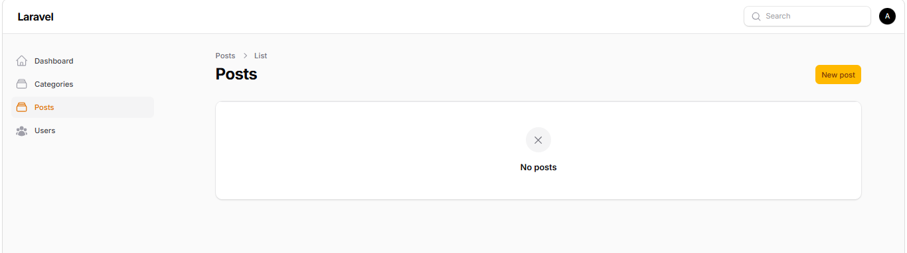
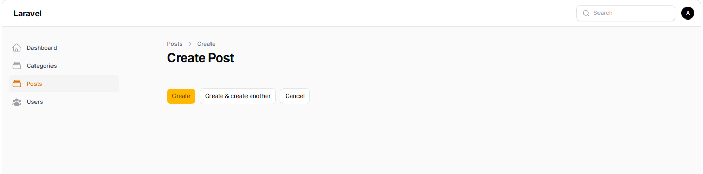

</blockquote>

 

<b>2. Implementasi Form Elements</b>

 
<blockquote>

*a. Text Input (Title&Slug)*
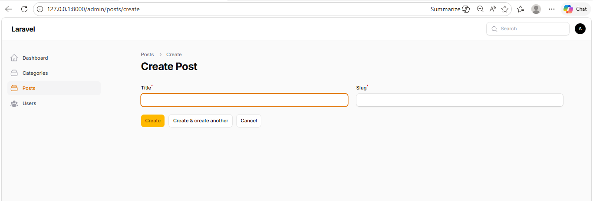

*b. Select (Relasi Category)*
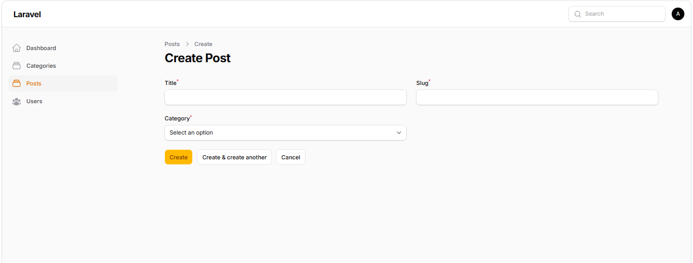

*c. Color Picker*
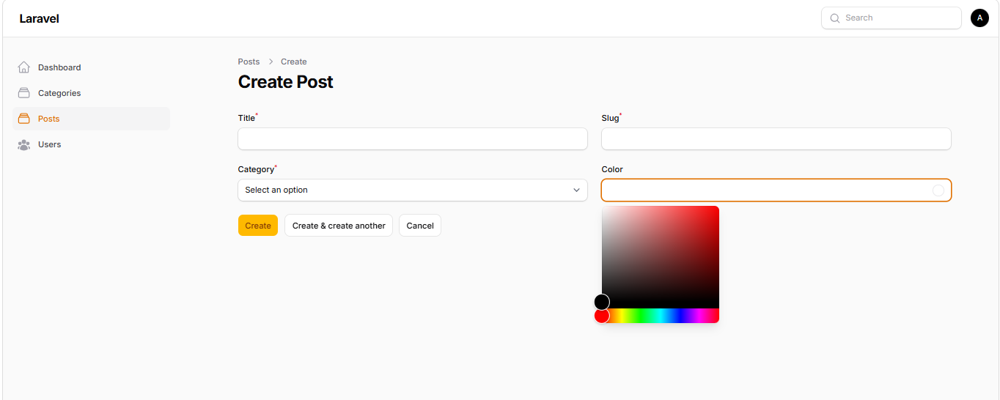

*d. Markdown*
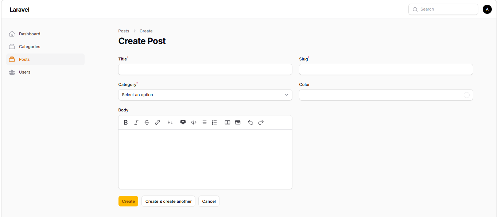

*e. RichEditor*
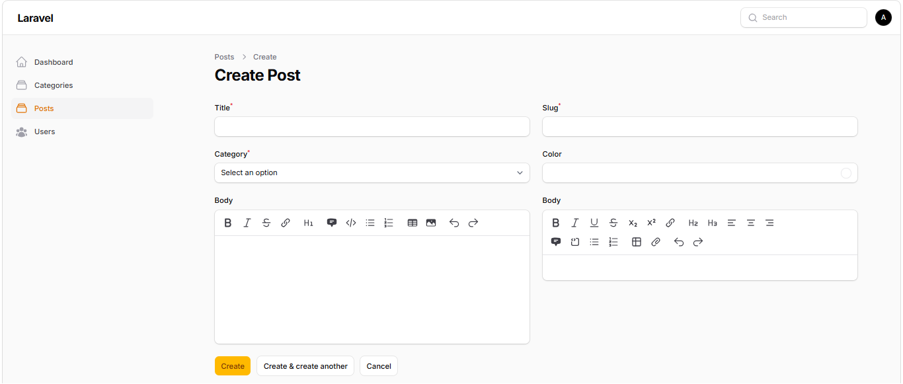

*f. File Upload (Image)*
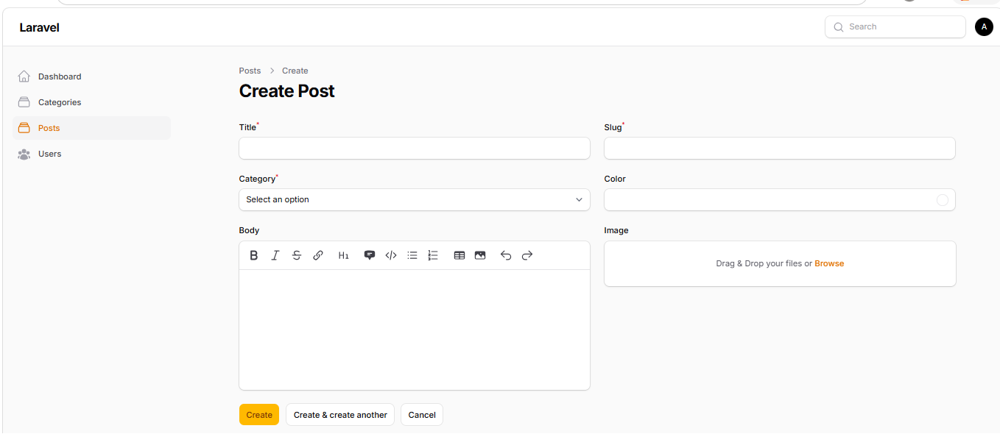
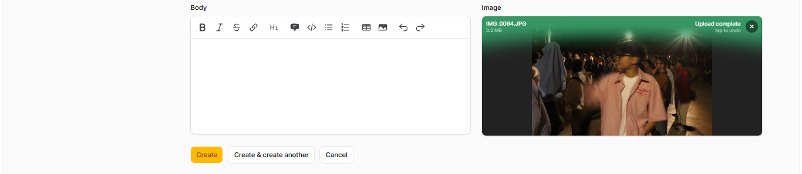

*g. Tags Input*
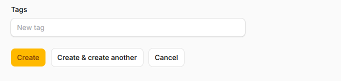

*h. Checkbpx (Published)*
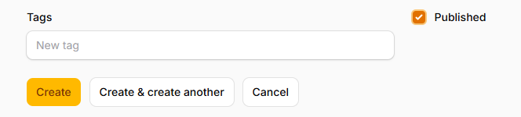

*i. Date Picker (Published At)*
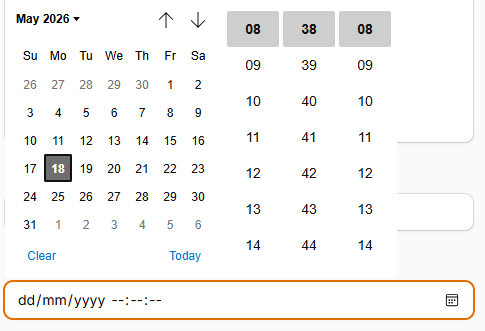

</blockquote>

 

<b>3. Menampilkan Data di Tabel</b>

 
<blockquote>

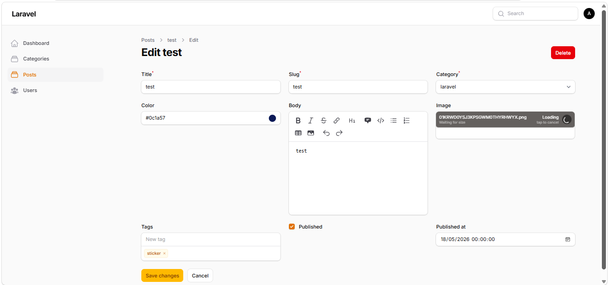
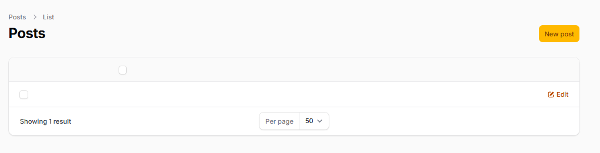
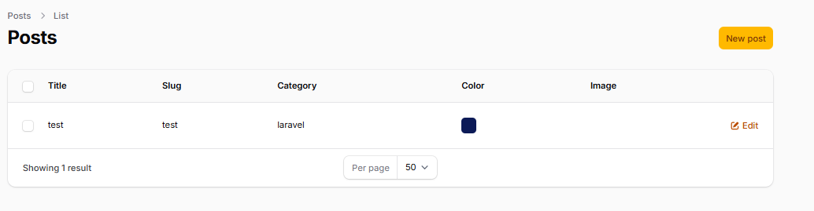

</blockquote>

 
 

<b>Analisis & Diskusi</b>

 
<blockquote>

*1. Mengapa kita perlu storage:link?*
 
Jawab : 
Secara default, Laravel menyimpan file yang diunggah (seperti gambar post) di dalam folder storage/app/public, yang mana folder ini tidak dapat diakses secara langsung melalui browser demi keamanan. Perintah php artisan storage:link berfungsi untuk membuat symbolic link (pintasan) dari folder public/storage ke storage/app/public. Dengan adanya link ini, file yang tersimpan di direktori internal storage dapat diakses dan ditampilkan oleh aplikasi web melalui URL publik.

*2. Apa fungsi $casts untuk field JSON?*
 
Jawab : 
Properti $casts pada model Laravel digunakan untuk mengubah tipe data field saat data disimpan atau diambil dari database secara otomatis. Untuk field bertipe JSON (seperti field tags), kita perlu melakukan cast ke tipe array. Hal ini dilakukan agar data JSON yang tersimpan sebagai string di database dapat langsung diolah sebagai struktur data array di dalam kode PHP (Filament), sehingga komponen seperti TagsInput dapat berfungsi dengan benar.

*3. Mengapa kita menggunakan category.name bukan category_id?*
 
Jawab : 
Penggunaan category.name pada tabel bertujuan agar data yang ditampilkan lebih komunikatif bagi pengguna (user-friendly). Jika kita menggunakan category_id, tabel hanya akan menampilkan angka ID yang sulit dipahami. Dengan memanggil relasi category.name, Filament akan mengambil nama kategori dari tabel terkait (relasi belongsTo) sehingga informasi yang muncul adalah nama kategori yang sebenarnya (misal: "Laravel" atau "PHP").

*4. Apa perbedaan RichEditor dan MarkdownEditor?*
 
Jawab : 
Meskipun keduanya digunakan untuk mengolah konten teks panjang, perbedaannya terletak pada format penyimpanan dan antarmukanya:
- MarkdownEditor: Digunakan untuk menulis teks dengan sintaks Markdown (seperti # untuk judul, ** untuk tebal). Data yang disimpan di database adalah teks mentah beserta kode Markdown tersebut.

- RichEditor: Merupakan editor WYSIWYG (What You See Is What You Get) yang memungkinkan pengguna memformat teks secara langsung melalui tombol-tombol (seperti MS Word). Data yang disimpan biasanya berupa tag HTML (seperti ,< b > atau < h1 >)

</blockquote>

 

---

## JOBSHEET WEEK 06 
### JOBSHEET 1 – Implementasi Form Elements & Resource Post di Filament

#### Dokumentasi Praktikum
 

<b>1. Membuat Resource Post</b>

 
<blockquote>

</blockquote>

 

<b>2. Implementasi Form Elements</b>

 
<blockquote>

**a. Text Input (Title&Slug)**

**b. Select (Relasi Category)**

**c. Color Picker**

**d. Markdown**

**e. RichEditor**

**f. File Upload (Image)**

**g. Tags Input**

**h. Checkbpx (Published)**

**i. Date Picker (Published At)**

</blockquote>

 

<b>3. Menampilkan Data di Tabel</b>

 
<blockquote>

</blockquote>

 
 

<b>Analisis & Diskusi</b>

 
<blockquote>

**1. Mengapa kita perlu storage:link?**
 
Jawab : 
Secara default, Laravel menyimpan file yang diunggah (seperti gambar post) di dalam folder storage/app/public, yang mana folder ini tidak dapat diakses secara langsung melalui browser demi keamanan. Perintah php artisan storage:link berfungsi untuk membuat symbolic link (pintasan) dari folder public/storage ke storage/app/public. Dengan adanya link ini, file yang tersimpan di direktori internal storage dapat diakses dan ditampilkan oleh aplikasi web melalui URL publik.

**2. Apa fungsi $casts untuk field JSON?**
 
Jawab : 
Properti $casts pada model Laravel digunakan untuk mengubah tipe data field saat data disimpan atau diambil dari database secara otomatis. Untuk field bertipe JSON (seperti field tags), kita perlu melakukan cast ke tipe array. Hal ini dilakukan agar data JSON yang tersimpan sebagai string di database dapat langsung diolah sebagai struktur data array di dalam kode PHP (Filament), sehingga komponen seperti TagsInput dapat berfungsi dengan benar.

**3. Mengapa kita menggunakan category.name bukan category_id?**
 
Jawab : 
Penggunaan category.name pada tabel bertujuan agar data yang ditampilkan lebih komunikatif bagi pengguna (user-friendly). Jika kita menggunakan category_id, tabel hanya akan menampilkan angka ID yang sulit dipahami. Dengan memanggil relasi category.name, Filament akan mengambil nama kategori dari tabel terkait (relasi belongsTo) sehingga informasi yang muncul adalah nama kategori yang sebenarnya (misal: "Laravel" atau "PHP").

**4. Apa perbedaan RichEditor dan MarkdownEditor?**
 
Jawab : 
Meskipun keduanya digunakan untuk mengolah konten teks panjang, perbedaannya terletak pada format penyimpanan dan antarmukanya:
- MarkdownEditor: Digunakan untuk menulis teks dengan sintaks Markdown (seperti # untuk judul, ** untuk tebal). Data yang disimpan di database adalah teks mentah beserta kode Markdown tersebut.

- RichEditor: Merupakan editor WYSIWYG (What You See Is What You Get) yang memungkinkan pengguna memformat teks secara langsung melalui tombol-tombol (seperti MS Word). Data yang disimpan biasanya berupa tag HTML (seperti ,< b > atau < h1 >)

</blockquote>

 

---

### JOBSHEET 2 Custom Layout Form dengan Section & Group di Filament

#### Dokumentasi Praktikum
 

<b>1. Mengatur Layout Dasar dengan Column</b>

 
<blockquote>

**a. Membuat 3 field dalam satu baris**
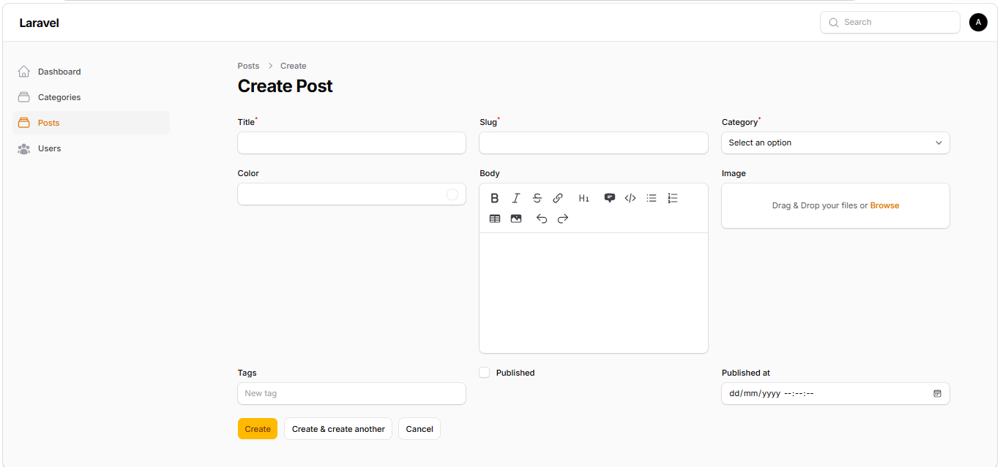
**b. Membuat layout yang berbeda**
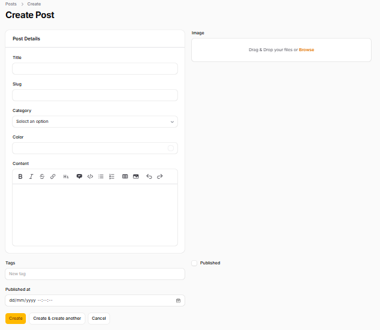

</blockquote>

 

<b>2. Menggunakan Section</b>

 
<blockquote>

**a. Membuat Section "Post Details"**
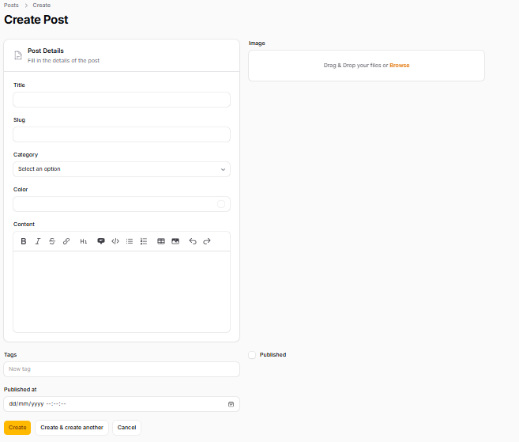
**b. Membuat Section Meta Data**
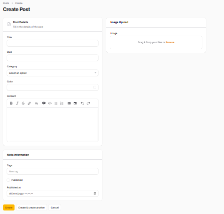

</blockquote>

 

<b>3. Menggunakan Group untuk Layout Horizontal</b>

 
<blockquote>

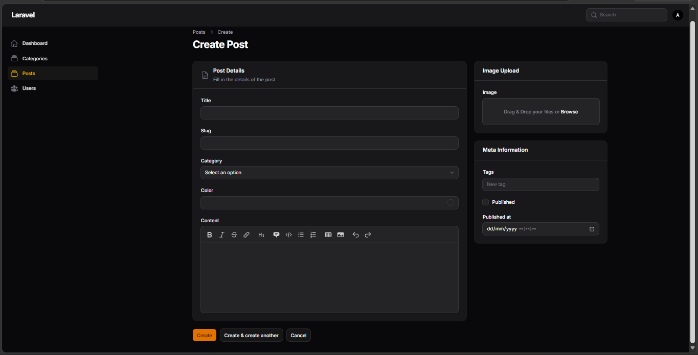
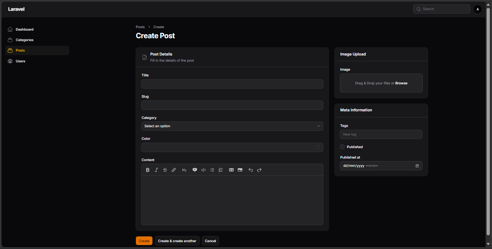

</blockquote>

 

<b>4. Mengatur Lebar Field Individual</b>

 
<blockquote>

</blockquote>

 

<b>Analisis & Diskusi</b>

 
<blockquote>

**1. Mengapa layout form penting dalam aplikasi admin?**
 
Jawab : 
Layout form yang baik sangat penting dalam aplikasi admin karena mempengaruhi efisiensi dan kenyamanan pengguna saat mengelola data. Dengan layout yang terstruktur, pengguna dapat dengan mudah menemukan field yang dibutuhkan tanpa harus scroll terlalu jauh. Selain itu, pengelompokan field yang logis menggunakan Section membantu pengguna memahami konteks setiap input, misalnya memisahkan antara informasi utama post, upload gambar, dan meta informasi. Layout yang rapi juga mengurangi kemungkinan kesalahan input karena field yang berkaitan diletakkan berdekatan, sehingga meningkatkan produktivitas administrator dalam mengelola konten aplikasi.

**2. Apa perbedaan Section dan Group?**
 
Jawab : 
Section dan Group sama-sama digunakan untuk mengatur tata letak form, namun memiliki perbedaan mendasar. Section menampilkan tampilan visual berupa kotak dengan judul, deskripsi, dan ikon yang terlihat jelas oleh pengguna, sehingga cocok digunakan untuk mengelompokkan field secara semantik agar pengguna tahu field mana yang saling berkaitan. Sementara itu, Group tidak memiliki tampilan visual apapun — tidak ada kotak, judul, maupun border. Group hanya berfungsi sebagai wadah tersembunyi untuk mengatur posisi dan lebar elemen secara horizontal menggunakan columnSpan(). Singkatnya, Section untuk pengelompokan yang terlihat pengguna, sedangkan Group untuk pengaturan layout yang tidak terlihat pengguna.

**3. Kapan kita menggunakan columnSpanFull()?**
 
Jawab : 
columnSpanFull() digunakan ketika sebuah field perlu mengambil seluruh lebar yang tersedia dalam grid, tanpa peduli berapa banyak kolom yang didefinisikan. Ini cocok diterapkan pada field yang membutuhkan ruang lebar seperti MarkdownEditor atau RichEditor untuk konten artikel, TextArea untuk deskripsi panjang, dan FileUpload yang membutuhkan area drag-and-drop yang luas. Pada jobsheet ini, MarkdownEditor::make('content')->columnSpanFull() digunakan agar editor konten memanjang penuh di bawah field Title, Slug, Category, dan Color yang tersusun 2 kolom, sehingga ruang menulis menjadi lebih lega dan nyaman.

**4. Apa keuntungan sistem grid 12 kolom?**
 
Jawab : 
Sistem grid 12 kolom memberikan fleksibilitas tinggi dalam mengatur tata letak form karena angka 12 dapat dibagi habis oleh banyak angka, yaitu 1, 2, 3, 4, 6, dan 12. Hal ini memungkinkan developer membuat berbagai variasi layout seperti 2 kolom sama rata (6+6), 3 kolom sama rata (4+4+4), layout asimetris seperti yang digunakan pada jobsheet ini (2/3 kiri + 1/3 kanan menggunakan columnSpan(2) dan columnSpan(1) dalam columns(3)), hingga layout 4 kolom (3+3+3+3). Sistem ini diadopsi dari framework CSS seperti Tailwind dan Bootstrap, sehingga developer yang sudah familiar dengan konsep grid CSS dapat langsung memahami dan menerapkannya di Filament dengan mudah.

</blockquote>

 

---

### JOBSHEET 3 Implementasi Form Validation pada Filament

#### Dokumentasi Praktikum
 

<b>1. Menambahkan Validasi</b>

 
<blockquote>

**a. Menggunakan Method required()**
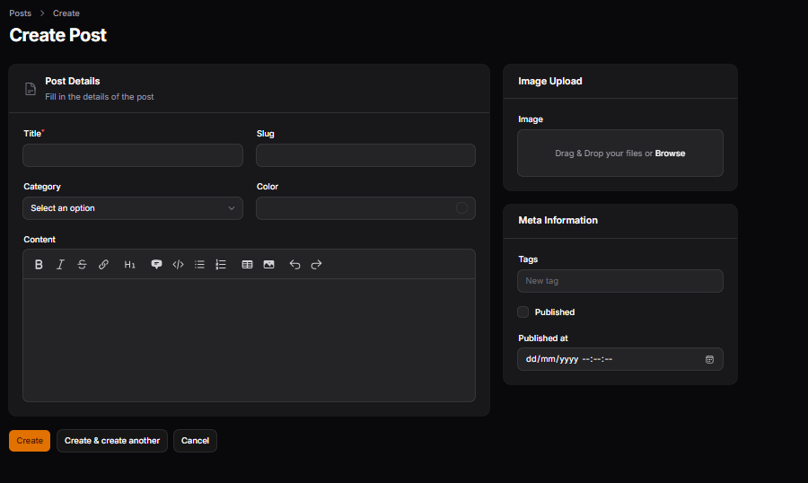

**b. Menggunakan rule()**
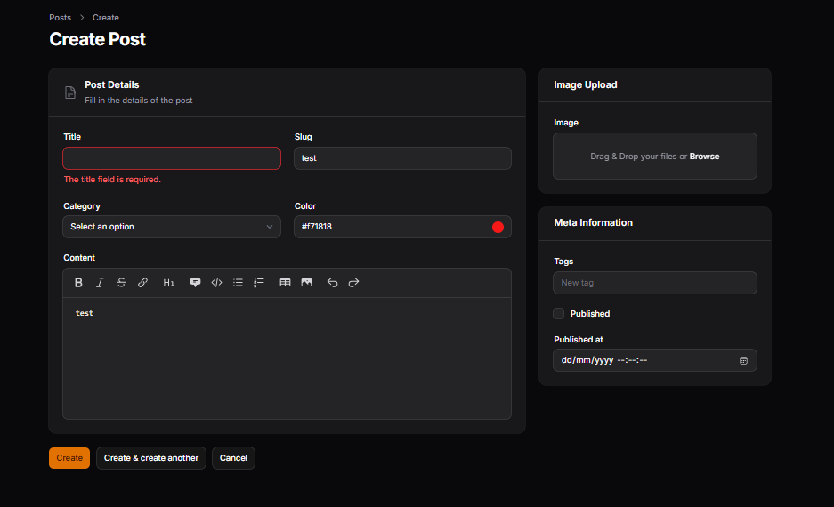

**c. Menggunakan rules() (Multiple Validation) Format String (Pipe)**
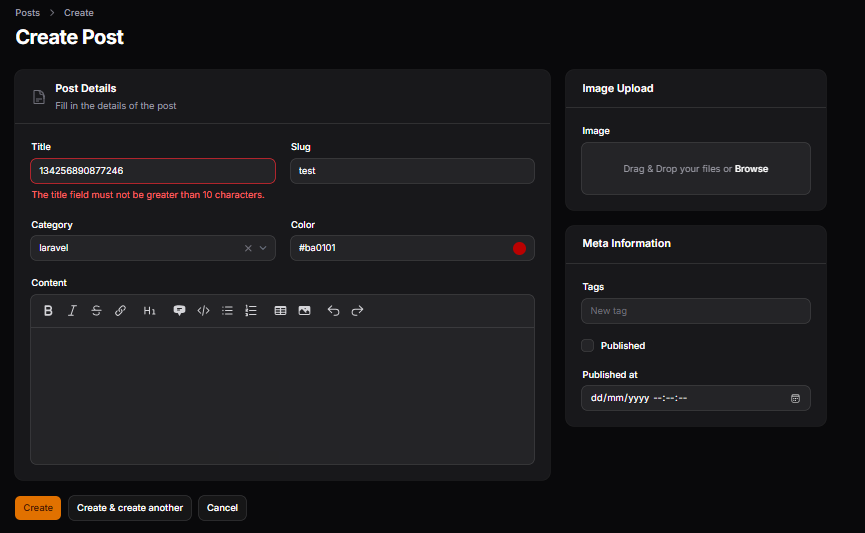

**d. Menggunakan rules() (Multiple Validation) Format Array**
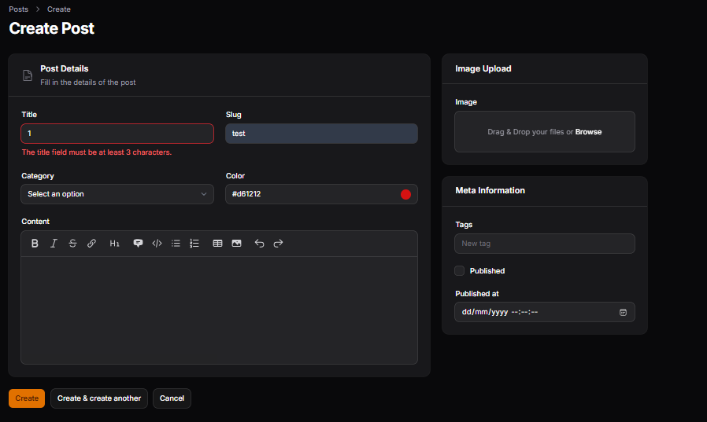

</blockquote>

 

<b>2. Validasi Unique</b>

 
<blockquote>

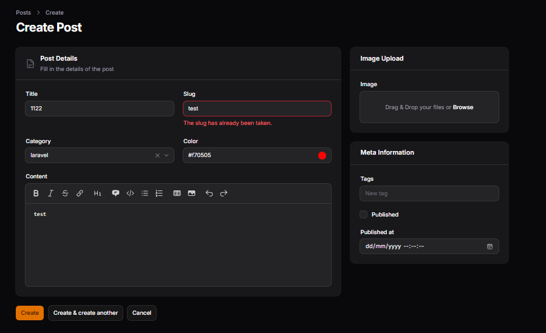

</blockquote>

 

<b>3. Mengganti Pesan Error (Custom Message)</b>

 
<blockquote>

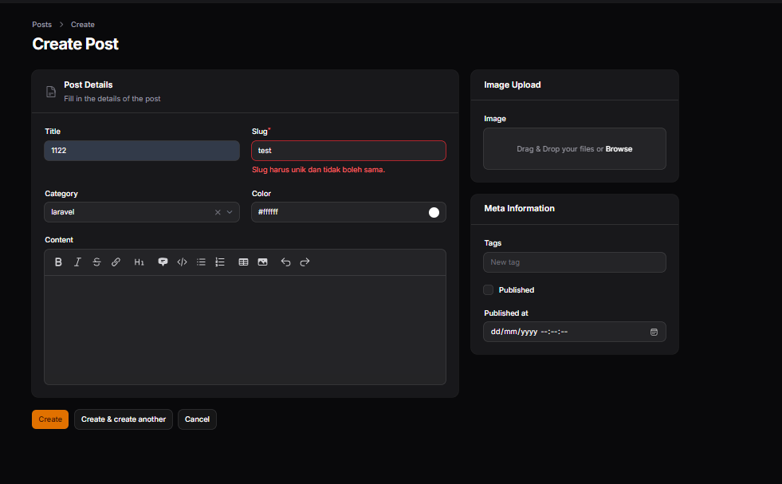

</blockquote>

 

<b>4. Validasi Lengkap Post</b>

 
<blockquote>

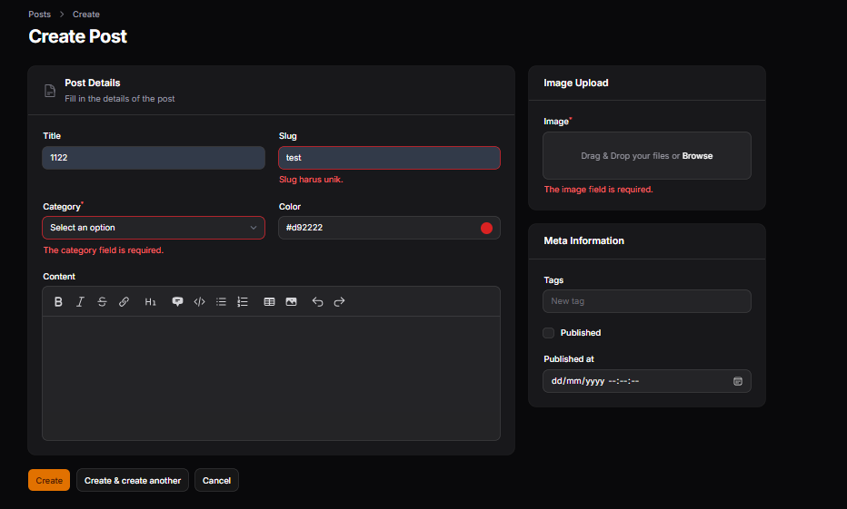

</blockquote>

 

<b>Analisis & Diskusi</b>

 
<blockquote>

**1. Mengapa validasi penting pada admin panel?**
 
Jawab : 
Validasi sangat penting pada admin panel karena data yang diinput oleh administrator akan langsung tersimpan ke database dan mempengaruhi keseluruhan sistem. Tanpa validasi, data yang tidak valid seperti judul kosong, slug duplikat, atau gambar yang tidak diunggah dapat menyebabkan error pada aplikasi, tampilan yang rusak, atau bahkan celah keamanan. Selain itu, validasi memastikan integritas data tetap terjaga sehingga aplikasi dapat berjalan dengan baik. Pada Filament, validasi terintegrasi langsung dengan sistem validasi Laravel sehingga developer tidak perlu menulis logika validasi secara terpisah di controller, melainkan cukup mendefinisikannya langsung pada komponen form.

**2. Apa perbedaan validasi client-side dan server-side?**
 
Jawab : 
Validasi client-side adalah validasi yang dilakukan di sisi browser sebelum data dikirim ke server, biasanya menggunakan HTML5 (seperti atribut required, maxlength) atau JavaScript. Validasi ini memberikan respons yang cepat kepada pengguna tanpa perlu menunggu respon dari server, namun kelemahannya adalah dapat dilewati oleh pengguna yang menonaktifkan JavaScript atau memanipulasi request secara langsung. Sementara itu, validasi server-side dilakukan di sisi server setelah data dikirim, seperti validasi yang diterapkan pada Filament menggunakan aturan Laravel. Validasi ini jauh lebih aman karena tidak dapat dimanipulasi dari sisi pengguna. Oleh karena itu, best practice dalam pengembangan aplikasi adalah menggabungkan keduanya — client-side untuk kenyamanan pengguna dan server-side untuk keamanan data.
**3. Mengapa unique otomatis bekerja saat edit data?**
 
Jawab : 
Filament secara cerdas menangani validasi ->unique() pada saat edit data dengan mengecualikan record yang sedang diedit dari pengecekan keunikan. Hal ini dilakukan karena ketika pengguna mengedit sebuah post tanpa mengubah slug-nya, nilai slug tersebut sudah ada di database milik record yang sama. Jika tidak ada pengecualian, validasi unique akan selalu gagal meskipun pengguna tidak mengubah apapun. Filament secara otomatis menambahkan klausa ignore berdasarkan primary key record yang sedang diedit, sehingga validasi hanya akan gagal jika slug yang diinput sudah digunakan oleh record lain, bukan oleh record itu sendiri.

**4. Kapan kita perlu menggunakan rules array dibanding string?**
 
Jawab : 
- String ('required|min:5|max:255'): Digunakan untuk validasi yang sederhana dan standar. Lebih ringkas dan mudah dibaca untuk aturan yang pendek.

- Array (['required', 'min:5', new CustomRule]): Digunakan ketika validasi menjadi lebih kompleks, misalnya ketika kita menyertakan Custom Validation Rule (objek kelas), menggunakan logika kondisional, atau jika aturan validasi mengandung karakter pipa (|) di dalamnya yang bisa membingungkan parser string Laravel.

</blockquote>

 

---

## JOBSHEET WEEK 07
### JOBSHEET 1 Implementasi Wizard Form (Multi Step Form) di Filament

#### Dokumentasi Praktikum
 

<b>Hasil Praktikum</b>

 
<blockquote>

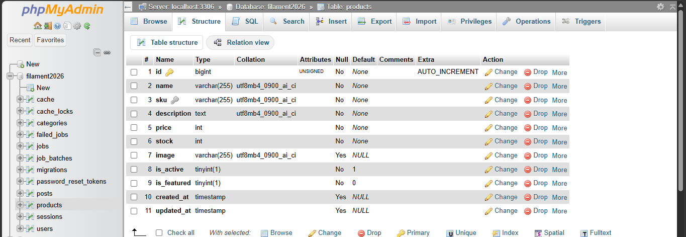
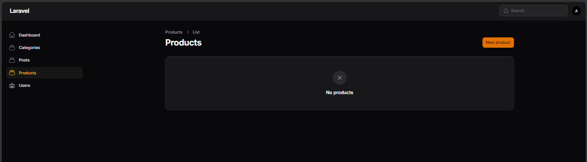
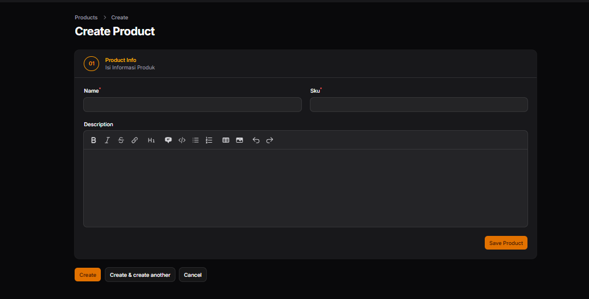
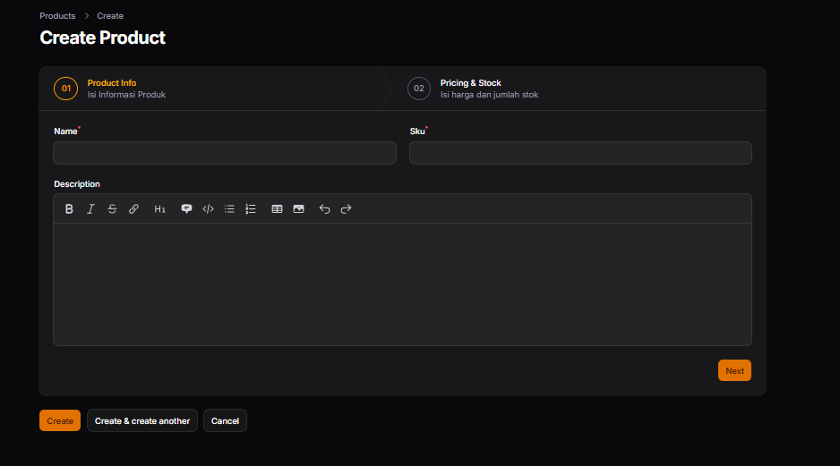
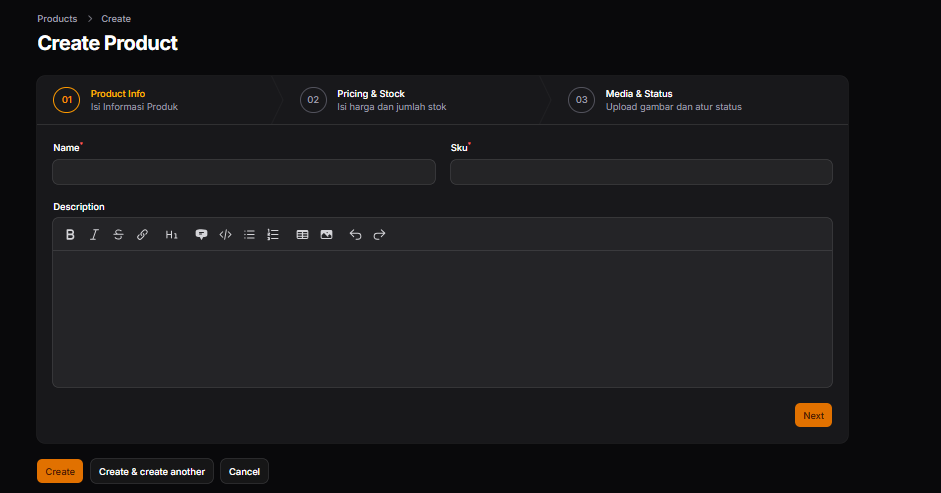
\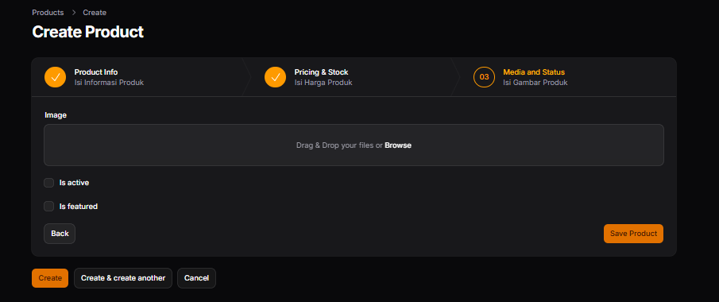
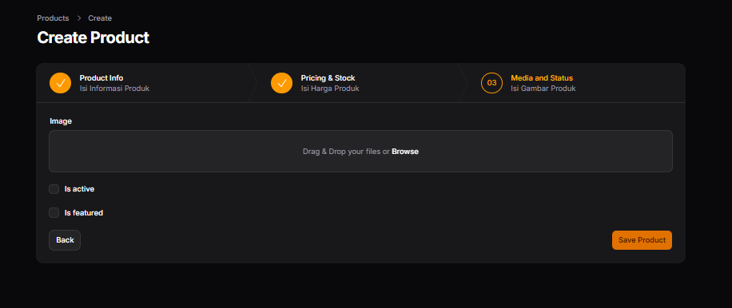
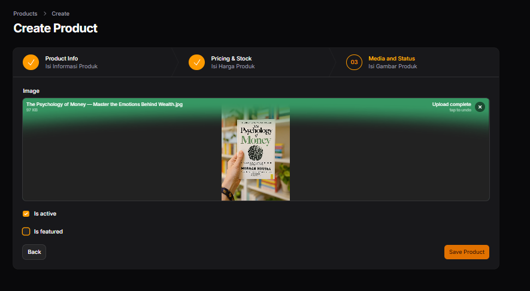
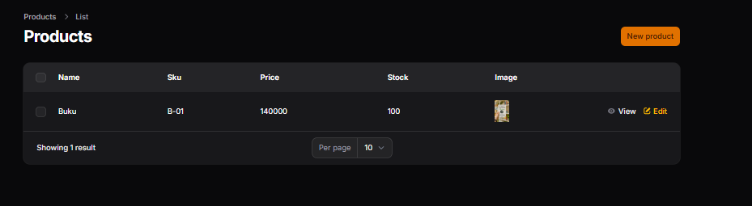

</blockquote>

 

<b>Analisis & Diskusi</b>

 
<blockquote>

**1. Mengapa Wizard Form lebih baik untuk form panjang?**
 
Jawab : 
Wizard Form dianggap lebih baik untuk formulir panjang karenaa menerapkan prinsip chunking, yaitu membagi informasi kompleks menjadi potongan-potongan kecil yang lebih mudah dikelola. Hal ini mengurangi beban kognitif pengguna dan mencegah rasa kewalahan (form fatigue) yang sering muncul saat melihat formulir tunggal dengan terlalu banyak kolom input sekaligus.

**2. Kapan kita menggunakan skippable()?**
 
Jawab : 
Fungsi skippable() digunakan pada langkah-langkah yang bersifat opsional atau tidak wajib diisi oleh semua pengguna. Fitur ini memberikan fleksibilitas agar pengguna dapat melewati bagian yang tidak relevan dengan kondisi mereka, sehingga alur pengisian tetap lancar dan tidak terhenti oleh validasi pada data yang sebenarnya tidak mutlak diperlukan.

**3. Apa kelebihan multi-step dibanding single form panjang?**
 
Jawab : 
Kelebihan utama multi-step form adalah peningkatan fokus pengguna dan tampilan antarmuka yang lebih bersih. Selain itu, multi-step memungkinkan adanya indikator progres yang memberikan kepastian psikologis mengenai sisa waktu pengisian, serta memudahkan proses validasi data per bagian agar kesalahan dapat langsung diperbaiki tanpa harus menunggu hingga akhir formulir.

**4. Apakah wizard cocok untuk semua jenis form?**
 
Jawab : 
Tidak, wizard tidak cocok untuk semua jenis formulir. Untuk formulir yang sangat pendek (hanya terdiri dari sedikit kolom) atau formulir yang memerlukan perbandingan data antar bagian secara cepat, penggunaan wizard justru akan menambah hambatan (friction) dan memperlambat pengguna karena harus berpindah-pindah halaman secara tidak efisien.

</blockquote>

 

---

### JOBSHEET 2 – Implementasi Info List (View Page) di Filament

#### Dokumentasi Praktikum
 

<b>Hasil Praktikum</b>

 
<blockquote>

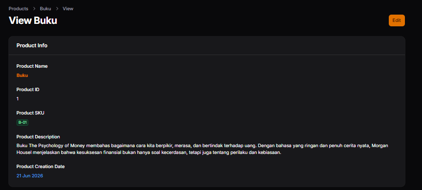
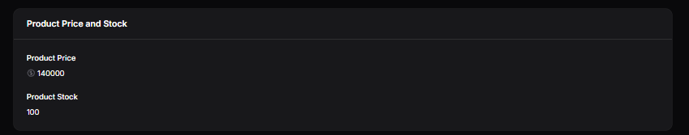
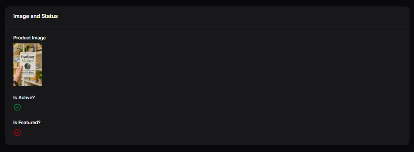

</blockquote>

 

<b>Analisis & Diskusi</b>

 
<blockquote>

**1. Mengapa View Page tidak cocok menggunakan form input?**
 
Jawab : 
View Page dirancang khusus untuk menampilkan data secara statis (read-only) dengan tujuan memberikan keterbacaan yang optimal bagi pengguna. Menggunakan form input di halaman ini tidak disarankan karena akan merusak hierarki visual dan fungsi utama halaman tersebut sebagai media peninjauan data; jika pengguna ingin melakukan perubahan, secara standar UX mereka harus diarahkan ke Edit Page agar proses validasi dan penyimpanan data tetap terisolasi dan aman.

**2. Apa perbedaan TextColumn dan TextEntry?**
 
Jawab : 
Perbedaan mendasar keduanya terletak pada konteks penggunaannya dalam komponen UI. 

- TextColumn digunakan di dalam tabel (List Page) untuk menyusun data dalam bentuk kolom-kolom vertikal yang seragam
- Sedangkan TextEntry digunakan di dalam Infolist atau View Page untuk menampilkan nilai data individual beserta labelnya dalam tata letak yang lebih fleksibel dan informatif.

**3. Kapan kita menggunakan badge?**
 
Jawab : 
Badge sebaiknya digunakan ketika kita ingin menonjolkan status atau kategori singkat dari sebuah data agar mudah dipindai (scannable) oleh mata pengguna. Komponen ini sangat efektif untuk membedakan kondisi tertentu secara visual melalui warna, seperti membedakan status transaksi "Sukses", "Pending", atau "Gagal" pada baris tabel atau detail informasi.

**4.Apa keuntungan menggunakan IconEntry untuk boolean?**
 
Jawab : 
Menggunakan IconEntry untuk data boolean (benar/salah) memberikan keuntungan berupa pemahaman instan melalui representasi visual daripada sekadar teks "Ya" atau "Tidak". Ikon seperti centang hijau atau silang merah jauh lebih cepat diproses oleh otak manusia, menghemat ruang pada antarmuka, dan memberikan kesan desain yang lebih modern serta intuitif bagi pengguna.

</blockquote>

 

---

### JOBSHEET 3 Implementasi Tabs pada Info List di Filament

#### Dokumentasi Praktikum
 

<b>Hasil Praktikum</b>

 
<blockquote>

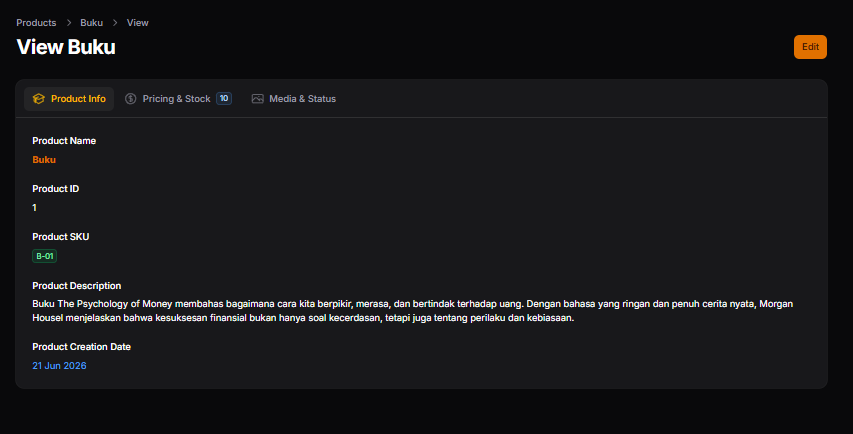
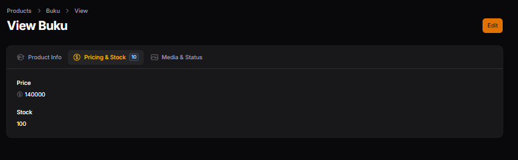
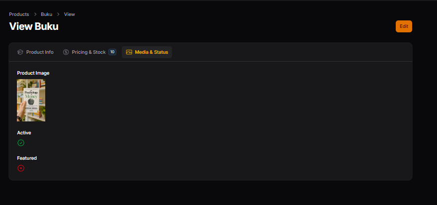
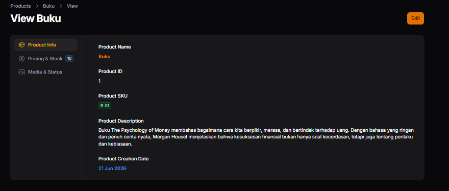

</blockquote>

 

<b>Analisis & Diskusi</b>

 
<blockquote>

**1. Kapan kita menggunakan Tabs dibanding Section?**
 
Jawab : 
Penggunaan Tabs lebih tepat dipilih ketika kita memiliki beberapa kelompok data yang setara secara hierarki namun tidak perlu dilihat secara bersamaan, sehingga ruang layar dapat dihemat. Sebaliknya, Section digunakan jika informasi tersebut harus dibaca secara berurutan atau pengguna perlu melihat keterkaitan antar kelompok data dalam satu tampilan gulir (scrolling) yang berkesinambungan.

**2. Apa kelebihan Tabs untuk data panjang?**
 
Jawab : 
Kelebihan utama Tabs untuk data yang sangat panjang adalah kemampuannya dalam mengorganisir informasi tanpa memperpanjang halaman secara vertikal. Dengan membagi data ke dalam tab-tab terpisah, antarmuka tetap terlihat rapi dan tidak mengintimidasi pengguna, serta memungkinkan akses langsung ke kategori informasi spesifik tanpa harus melakukan pencarian manual melalui guliran halaman yang panjang.

**3. Apakah Tabs bisa digunakan pada Form juga?**
 
Jawab : 
Ya, Tabs sangat efektif digunakan pada formulir untuk mengelompokkan input berdasarkan kategori tertentu, seperti "Informasi Dasar", "Alamat", dan "Pengaturan Akun". Penggunaan tab pada formulir membantu menjaga fokus pengguna pada satu topik pengisian dalam satu waktu, mirip dengan prinsip multi-step form, namun dengan fleksibilitas navigasi yang lebih bebas antar bagian.

**4. Bagaimana jika tab terlalu banyak?**
Jika jumlah tab terlalu banyak hingga melampaui lebar layar, hal ini akan menurunkan pengalaman pengguna karena navigasi menjadi sulit dan beberapa label mungkin tersembunyi. Solusi terbaik adalah meninjau kembali pengelompokan data, menggunakan menu dropdown untuk tab tambahan, atau beralih menggunakan komponen navigasi vertikal (Sidebar) yang lebih mampu menampung banyak kategori tanpa mengorbankan keterbacaan.

</blockquote>

 

---

## JOBSHEET WEEK 10 

### Implementasi Sorting (Ascending & Descending) pada Table Filament
 

<b>Hasil Praktikum</b>

 
<blockquote>

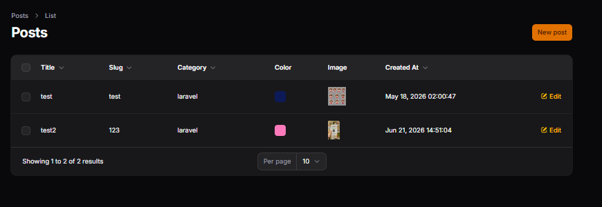
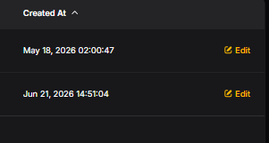

</blockquote>

 

<b>Analisis & Diskusi</b>

 
<blockquote>

**1. Mengapa sorting penting pada admin panel?**
 
Jawab : 
Sorting sangat penting dalam panel admin untuk meningkatkan efisiensi navigasi dan akurasi manajemen data yang berjumlah besar. Tanpa fitur pengurutan, admin akan kesulitan menemukan entitas spesifik seperti transaksi terbaru, stok barang yang hampir habis, atau pengguna paling aktif di antara ribuan baris data lainnya. Kemampuan untuk mengatur urutan data secara dinamis memungkinkan admin melakukan analisis cepat dan pengambilan keputusan yang lebih tepat tanpa harus melakukan pencarian manual yang membuang waktu.

**2.  Apa perbedaan sortable biasa dengan defaultSort()?**
 
Jawab : 
Perbedaan utama antara keduanya terletak pada kontrol pengguna dibandingkan dengan inisialisasi sistem. Atribut sortable biasanya merujuk pada fitur antarmuka yang memungkinkan pengguna akhir secara manual mengubah urutan kolom dengan mengeklik header tabel sesuai kebutuhan mereka saat itu. Sebaliknya, defaultSort() adalah instruksi di tingkat kode yang menentukan urutan data secara otomatis saat halaman pertama kali dimuat, memastikan bahwa admin langsung melihat data dalam susunan yang paling relevan (seperti data terbaru) sebelum melakukan interaksi apa pun.

**3. Mengapa relasi tetap bisa di-sort?**
 
Jawab : 
Relasi tetap bisa diurutkan karena sistem backend atau ORM melakukan operasi penggabungan tabel (join) atau menggunakan subquery untuk menarik data terkait ke dalam satu hasil kueri yang terintegrasi. Meskipun secara fisik data tersebut berada di tabel yang berbeda, perintah SQL ORDER BY dapat diarahkan ke kolom pada tabel relasi tersebut setelah hubungan antar tabel didefinisikan melalui kunci tamu (foreign key). Hal ini memungkinkan data utama tetap teratur berdasarkan informasi yang tersimpan di tabel pendukungnya.

**4. Kapan kita menggunakan desc sebagai default?**
 
Jawab : 
Penggunaan urutan menurun atau descending (DESC) sebagai standar biasanya diterapkan pada data yang bersifat kronologis atau berbasis prioritas di mana informasi terbaru atau tertinggi memiliki relevansi paling besar. Sebagai contoh, pada tabel log aktivitas, transaksi keuangan, atau pesan masuk, admin umumnya perlu melihat entitas yang baru saja terjadi di baris paling atas tanpa harus melakukan scrolling ke bawah. Selain itu, urutan DESC ideal digunakan untuk memantau peringkat atau nilai numerik terbesar agar data yang paling signifikan langsung terlihat oleh pengguna.

</blockquote>

 

---

## JOBSHEET WEEK 11

### Implementasi Search & Filter pada Table Filament
 

<b>Hasil Praktikum</b>

 
<blockquote>

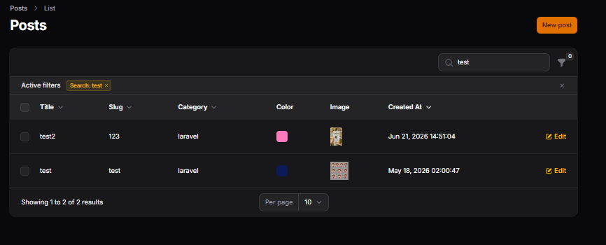
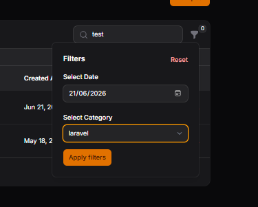

</blockquote>

 

<b>Analisis & Diskusi</b>

 
<blockquote>

**1. Mengapa search tidak cocok untuk filter tanggal?**
 
Jawab : 
Fitur search pada dasarnya bekerja dengan membandingkan kecocokan teks atau string secara parsial (partial match) menggunakan logika LIKE pada database. Tanggal di dalam database biasanya disimpan dalam format standar (seperti YYYY-MM-DD), sehingga jika pengguna mencari dengan format berbeda (misalnya "28 Feb"), sistem search sering kali gagal menemukannya karena perbedaan penulisan karakter. Sementara itu, filter menggunakan komponen khusus seperti DatePicker yang memungkinkan pencarian dilakukan berdasarkan nilai objek tanggal yang pasti, bukan sekadar kecocokan teks.

**2.  Apa fungsi relationship() pada SelectFilter?**
 
Jawab : 
Method relationship() pada SelectFilter berfungsi untuk menghubungkan filter secara otomatis dengan data yang ada pada tabel relasi di database. Dengan menggunakan method ini, Filament akan secara otomatis mengambil daftar data dari tabel terkait (misalnya mengambil semua nama dari tabel categories) dan menampilkannya sebagai opsi pilihan dalam dropdown filter. Hal ini memudahkan pengembang karena tidak perlu menulis kueri manual untuk memunculkan daftar kategori yang tersedia bagi admin.

**3. Mengapa kita perlu whereDate() pada query filter?**
 
Jawab : 
Kita membutuhkan whereDate() karena kolom seperti created_at biasanya memiliki tipe data datetime yang menyimpan informasi hingga satuan jam, menit, dan detik. Jika kita menggunakan perbandingan biasa (=), sistem akan mencari data yang waktunya tepat hingga ke detiknya, sehingga data sering tidak muncul meskipun tanggalnya sama. Fungsi whereDate() memerintahkan database untuk hanya membandingkan bagian tanggalnya saja (Tahun-Bulan-Hari) dan mengabaikan bagian waktunya, sehingga pencarian tanggal menjadi akurat.

**4. Apa perbedaan searchable() dan filters()?**
 
Jawab : 
Perbedaan utamanya terletak pada cara kerja dan input yang digunakan pengguna untuk menemukan data. Method searchable() digunakan untuk mengaktifkan kolom pencarian teks yang bekerja secara real-time melalui satu kotak input global di atas tabel, biasanya untuk kolom seperti judul atau slug. Sedangkan filters() menyediakan menu khusus (biasanya dalam bentuk ikon corong) yang berisi berbagai komponen input seperti dropdown atau pemilih tanggal untuk menyaring data berdasarkan kondisi yang lebih spesifik dan terstruktur.

</blockquote>

 

---

Tahun Akademik 2025/2026
